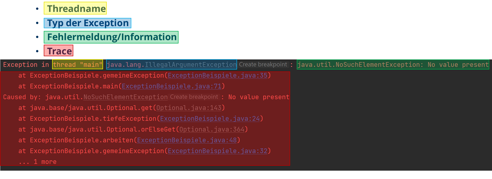

# Spickzettel (Debugging)

## Begriffe

| Begriff     | Bedeutung                                                                                          | Kommentar                                                                                                                                                                                                               |
|-------------|----------------------------------------------------------------------------------------------------|-------------------------------------------------------------------------------------------------------------------------------------------------------------------------------------------------------------------------|
| Debugging   | Handlung um Fehler im Quellcode zu finden                                                          | Testen ist kein Debugging; Es ist eine Folge des Testens                                                                                                                                                                |
| Debugger    | Ein System zum Überwachen und Steuern einer Anwendung                                              |                                                                                                                                                                                                                         |
| Bug         | Ein (Laufzeit-) Fehler in einem Programm                                                           | auch Defect, fault = Fehler                                                                                                                                                                                             |
| Fehler      | Ungewünschte Situation, Ereignis, Werte, etc.                                                      | auch Fehlerzustand                                                                                                                                                                                                      |
| Ursache     | Die Aktivität, die einen Fehler auslöst                                                            | auch error, Fehlerhandlung; Es ist nicht einheitlich geregelt was man als Ursache versteht. Sowohl der Grund zum erzeugen des Fehlers, als auch die Ausführung und damit Auslösen der Fehlerwirkung können valide sein. |
| Auswirkung  | Folge eines Fehlers (falsches Ergebnis, Absturz, etc.)                                             | auch Fehlerwirkung, fail                                                                                                                                                                                                |
| Exception   | (Ausnahme) von der normalen Aufgabe abweichender Ausgang                                           |                                                                                                                                                                                                                         |
| Stack Trace | Auflistung aller Aufrufe von Methoden mit Aufrufsorten                                             |                                                                                                                                                                                                                         |
| Frame       | In Java die Darstellung eines Methodenaufrufs mit Parametern, Rücksprungadresse und Variablen etc. |                                                                                                                                                                                                                         |
| Breakpoint  | Ein Haltepunkt. Sagt dem Debugger, dass die Ausführung des Programmes anhält                       |                                                                                                                                                                                                                         |
| Scope       | Gültigkeitsbereich von Variablen, Klassen, Methoden, etc.                                          |                                                                                                                                                                                                                         |
| Testen      | Systematisches Verfahren zum finden von Fehlerzuständen                                            | siehe GTB-1 [1.1]                                                                                                                                                                                                       |

## Debugging

### Debugging-Tools

- **Variablen-Inspektor** - Zeigt den aktuellen Wert von Variablen an
- **Breakpoints** - Haltepunkte, die das Programm anhalten, wenn sie erreicht werden
- **Frame-Fenster** - Zeigt den aktuellen Call Trace an, also die Aufrufe von Methoden
- **Expression-Evaluator** - Erlaubt das Auswerten von Ausdrücken während des Debuggens (Viele Bezeichnungen)

### Fortbewegung im Code

* **Step Over** - Führt die aktuelle Zeile aus, ohne in die Methode hineinzugehen; außer die Method hat einen Breakpoint
* **Step Into** - Spring in die nächste Anweisung hinein, falls es eine gibt, sonst in die nächste Zeile
* **Step Out** - Springt setzt die Ausführung der Methode bis zum Ende fort und hält dann an in der aufrufenden Methode
* **Continue** - Setzt die Ausführung des Programms fort, bis ein Breakpoint erreicht wird oder das Programm endet

<hr>

## Stack Trace



<hr>

## Tests

- Tests zeigen Fehlerwirkungen
- Test prüfen, Ist-Werte gegen Soll-Werte
- Zeigen **nicht** die Bugs, nur die Hinweise auf den Ort

Ausgänge von Tests:

* success
* failure
* error
* skipped

<hr>

## Anderes

### Exception Handling

```jshelllanguage
try {
	// Code, der eine Exception auslösen könnte
} catch (ExceptionType e) {
	// Code, der ausgeführt wird, wenn eine Exception auftritt
	// kann Exception werfen mit mehr Informationen z.B.
	throw new CustomException("Fehler aufgetreten, wegen der Exception", e);
} 
```

### Logging

Benötigt ein Logging Objekt, das die Logik für das Schreiben der Log-Ausgaben enthält. Es kann in verschiedenen Stufe konfiguriert werden. Oft wird pro Klasse ein eigenes Logging Objekt erstellt, das dann in der Klasse verwendet wird.
Gängige Stufen sind:

* **DEBUG** - Detaillierte Informationen, die nur für die Entwicklung nützlich sind
* **INFO** - Allgemeine Informationen über den Programmablauf
* **WARN** - Warnungen, die auf mögliche Probleme hinweisen, aber nicht unbedingt Fehler sind
* **ERROR** - Fehler, die aufgetreten sind, aber das Programm nicht zum Absturz gebracht haben
* **FATAL** - Kritische Fehler, die das Programm zum Absturz bringen können

<hr>

## Quellen

GTB-1 : https://www.gtb.de/wp-content/uploads/2025/04/ISTQB_CTFL_Lehrplan-2025_V4.0.2_DE.pdf
