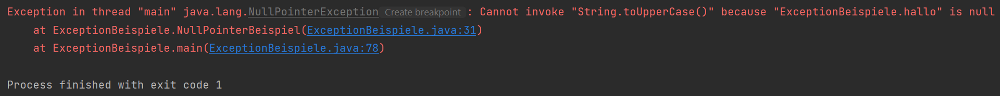
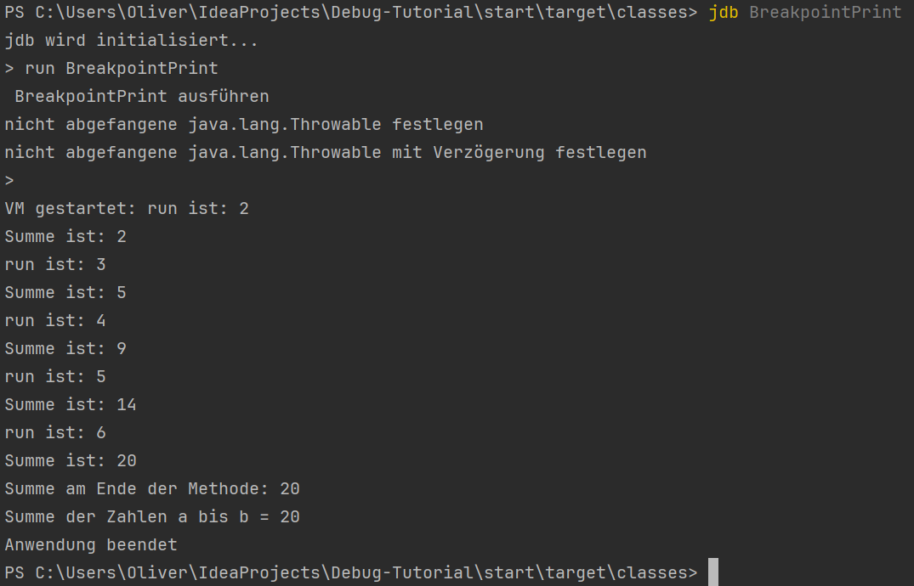

# Debug-Tutorial

Dies ist eine Einführung in das Debugging mit IDEs.
Es soll anhand mehrerer kleiner Beispiele die Grundlagen, für Bugs
und Debugging, verständlich beigebracht werden.
Wenn die Grundlagen abgeschlossen wurden, dann soll in einem großen Beispiel das Erlernte geübt werden.
Alle Beispiele und Erklärungen sind in Java geschrieben bzw. beziehen sich auf Java.
In anderen Programmiersprachen kann es sein, dass manche Konzepte etwas anders funktionieren.

Die Einführung, mit den entsprechenden Java-Dateien, ist in dem Ordner `start/src/main/java` zu finden.
Das große Beispiel, mit den entsprechenden Java-Dateien, ist in dem Ordner `bibliothek-beispiel/src/main/java` zu finden.

## Bugs

Bugs ist ein allgemeiner Begriff für **Fehler** in der Informatik/Programmierung.
In der Programmierung sind Bugs oft **Laufzeitfehler** bzw. ein **Fehlerzustand**.
Dieser Zustand ist unerwünscht und führt zu einer **unerwünschten Folge**.
Dieser Zustand muss aber erst erreicht werden. Nur wenn das Programm ausgeführt wird kann der Fehlerzustand erreicht werden.
Jeder Bug wird also erst durch eine **Ursache** zum Bug.
Diese ist meist im Code versteckt.\
Es gibt also eine Handlung (Ursache), die durch einen Fehlerzustand (Bug) und zu einer ungewünschten Folge (Wirkung) führt.
Leider wird auch gerne mal die Ursache als Bug bezeichnet und kann damit zur Verwirrung führen.
Die Begriffe, die sich dafür in der Industrie genutzt werden, lauten etwas anders und können
bei [ISTQB/GTB](https://www.german-testing-board.info/lehrplaene/istqbr-certified-tester-schema/entwicklungstester/) oder [IEEE](https://ieeexplore.ieee.org/document/5399061) nachgelesen werden.
Im weiteren Verlauf des Textes bleiben wir jedoch bei den "einfacheren" Begriffen Ursache, Bug, Fehler.

Die Ursachen für Bug können dabei verschieden sein.
Mögliche Ursachen sind:

* Syntax - ein Zeichen vergessen oder zu viel
* Semantik - Interpretation ist falsch/ `>` statt `<` als Vergleich
* Logik - Abfolge des Programmes in falscher Reihenfolge

Der Begriff **Debugging** bezeichnet also die Beseitigung von Ursachen, welche einen Bug auslösen.

### Einen Bug finden

Bugs kündigen sich nicht an. Sie können nur durch die Fehlerwirkung bemerkt werden.
Allgemein gibt es zwei Möglichkeiten, wie ein Bug bemerkt werden kann.

1. Ein falsches Ergebnis wurde ausgegeben
2. Eine Exception/Absturz des Programmes trat auf

Beide Varianten werden in diesem Projekt vorgestellt.
Im Beispiel "summeVonBis" wird ein falscher Wert ausgegeben.
Die zweite Variante wird primär in den darauffolgenden Beispielen behandelt.
Leider kann besonders die erste Variante sehr schnell übersehen werden, weshalb genau dafür **Tests** existieren.
Deshalb wird im zweiten Teil dieser Einführung das Thema 'Tests' behandelt.

Die zweite Möglichkeit ist leichter zu bemerken, da sie zu einem Anhalten des Programmes führt.
Oft steht auch noch die Nachricht in der Fehlerausgabe.
Wie diese Nachricht zu interpretieren ist, wird im folgenden Kapitel ["Stack trace lesen und verstehen"](#stack-trace-lesen-und-verstehen) erklärt.

<hr>

## Wie es nicht geht!

In der Datei *Breakpoint.java* ist eine Funktion summeVonBis(a, b).
Diese Funktion soll die Summe von a bis b (inklusive beider Zahlen) zurückgeben.
Jedoch ist ein Fehler in dem Programm und das Ergebnis ist falsch.
Dementsprechend schlagen die dazugehörigen Tests (`src/test/java/BreakpointTest.java`) fehl.
Es wurde also durch die Fehlerwirkung bemerkt, dass ein Bug im Programm ist.
Analysiert man jetzt den Code, so findet man ziemlich schnell die Ursache.
Doch um zu verstehen, wozu ein Debugger gebraucht wird, sei jetzt mal angenommen der Fehler wird nicht auf den ersten Blick gefunden.

```Java
public class Breakpoint {

	public static int summeVonBis(int a, int b) {
		if (a > b) {
			int temp = a;
			a = b;
			b = temp;
		}
		int summe = 0;
		for (int run = a; run < b; run++) {
			summe += run;
		}
		return summe;
	}
	//...
}
```

### Was man instinktiv tut.

Wenn der Fehler nicht ersichtlich ist, würde ein erster Gedanke sein, die Werte, die sich in der Schleife verändern, auf
der Konsole auszugeben.
Das wäre beispielsweise ```System.out.println("run ist: " + run);```.
*BreakpointPrint.java* zeigt eine Möglichkeit, wie `print` zur Fehlersuche genutzt werden kann.\
In der Konsole fällt auf, dass "run" höchstens 6 ist.
Damit fehlt ein Durchlauf und es ist klar, wo der Fehler ist.
Er ist im Schleifenkopf. Es handelt sich um einen sogenannten "Off by one"-Fehler.
Das bedeutet, das große Ganze ist korrekt, nur ist die Berechnung ist um eins falsch.
Eine Lösung wäre demnach entweder die Bedingung in ```i < b + 1``` oder ```i <= b``` zu ändern.

#### Probleme

Bei diesem Vorgehen gibt es jedoch einige Probleme.
Für jede Variable, die ausgegeben werden soll, muss eine print-Anweisung geschrieben werden.
Zudem sind alle print-Anweisungen mit extra Informationen zu versehen, damit der Entwickler überhaupt weiß, welche
Variable jetzt ausgegeben wurde.
Diese Anweisungen müssen nach dem Beseitigen des Fehlers aber wieder entfernt werden.
Ansonsten stehen unnötige und vlt. sogar verwirrende Zeilen in der Ausgabe, wenn das Programm normal genutzt wird.\
Diese Lösung ist für kleine Beispiele noch vertretbar.
Wenn jedoch Projekte mit tausenden Zeilen Code einen Fehler haben, dann ist diese Lösung sehr suboptimal.
Da überall print-Statements gesetzt werden müssen, ist der Code damit überschwemmt und nachdem der Fehler behoben
wurde müssen alle print-Statements entfernt werden und dabei können leicht Anweisungen übersehen werden.\

Ein weiteres Problem ist, dass das Programm durchläuft und nicht angehalten werden kann.
Es muss die gesamte Ausgabe durchsucht und verstanden werden, um zu wissen, was an welcher Stelle passiert ist.
Es wäre also gut auf Wunsch anzuhalten und dann Schritt für Schritt voranzugehen.
Das Könnte mit einer Input-Abfrage an bestimmten stellen programmiert werden, aber auch das muss am Ende wieder entfernt werden.

Das nächste Problem ist, dass die Werte nicht verändert werden können.
Das klingt erst mal nutzlos, es gibt aber Situationen, in denen man zu Testzwecken den Wert einer Variable ändern möchte,
um ein anderes Verhalten als normal zu erhalten.
Des Weiteren ist die Übersicht, durch die vielen Ausgaben, sehr schwer.
Eine Filterung der Ausgaben muss deshalb mit programmiert werden.

### Etwas besser aber ...

Zumindest zwei Probleme lassen sich mit **Loggern** lösen.
Durch Logger kann die Filterung deutlich einfacher programmiert werden.
Auch durch die Nutzung mehrerer Logger bzw. durch die Nutzung der verschiedenen
**Level** ist die zusätzliche Information und Filterung kein Problem mehr.
Ein Beispiel für das Nutzen eines Loggers ist in der Datei `BreakpointLogging.java` zu finden.

Es bleiben aber die Probleme, dass Code geschrieben und (gegebenenfalls) wieder entfernt werden muss und das Programm nicht unterbrechbar
ist.

#### Logging ist dennoch wichtig

Logging ist eine Hilfe zum Debuggen.
Allgemein sollte Logging im Projekt genutzt werden.
So sollte jede Exception in einem Log stehen und mit dem richtigen Level versehen sein.
Jedoch hilft Logging beim Debugging nur die Ursache bzw. den Ort des Fehlers zu finden, wenn das Log informativ ist.
Die Wahl des Logging-Levels und der mitgelieferten Informationen sollten deshalb gut gewählt sein.
Logging sollte aber eben **nicht genutzt** werden, um einen Fehler zu finden und nach dem
Beheben des Fehlers das Logging **wieder zu entfernen**.

<hr>

## Stack trace lesen und verstehen

Die Variante, die am ehesten auffällt, wenn ein Bug auftritt, ist die Exception.
Wenn eine nicht gefangene Exception in Java auftritt, dann wird ein sogenannter **Stack Trace** ausgegeben.
Dieser enthält 4 wichtige Informationen:

1. Name des Threads in dem die Exception auftrat
2. Typ der Exception
3. Beschreibung/Grund der Exception
4. "Trace" bzw. Call Stack

Die vier Bestandteile sollen mit dem Beispiel in der Datei `start/src/main/java/ExceptionBeispiele.java` erklärt werden.
Es werden 4 verschiedene Exceptions geworfen.
Die Wahl der Exception geschieht durch das übergebene Programmargument.
Startet man das Programm mit dem Argument "0", so wird eine `NullPointerException` geworfen.
Der Stack Trace sieht dann wie folgt aus:



<p style="background-color: #ffe877; border-left: 6px solid #2196F3; padding: 10px;">
    Nicht jede Programmiersprache hat einen Stack Trace. In C ist es so, dass es keinen Stack Trace gibt, weil es auch keine Exceptions gibt. 
    Zwar ist die Ausführung in C deutlich schneller, weil es keine Exception-Handler gibt, jedoch ist das Debuggen deutlich schwerer. 
</p>

### Passende Beschreibung wählen

Der **Name des Threads** ist bei Single-Threaded-Anwendungen immer der _main_-Thread (Java).
Der Name ist nur wichtig, wenn die Anwendung mehrere Threads nutzt.\
Der **Typ** der Exception ist schon wichtiger. Er soll eine grobe Einordnung geben, wieso der Fehler auftrat.
Deswegen sollten auch immer die Typen der Exception gut gewählt und beschreibend sein.\
Die konkrete Information, warum der Fehler auftrat, soll dann die **Beschreibung** der Exception geben.
In `ExceptionBeispiele.java` ist das zweite Beispiel (Argument "1") eines, welches keine Informationen über die Ursache gibt.
Es wurde eine RuntimeException geworfen und als Grund "Es ist ein Fehler aufgetreten" ausgegeben.
Gut so schlau war man schon vorher, dass ein Fehler aufgetreten ist, das Programm ist ja abgestürzt.
Der Informationsgehalt des Stack Trace ist also gleich null.
Deshalb sollte immer gut überlegt werden, welche Exception geworfen wird und welche Information mitgegeben wird.

Wie sieht jetzt eine gute Beschreibung aus?
Beispielsweise gibt es in der Datei `ExceptionBeispiele.java`, wenn man die Anwendung mit dem Argument "2" startet, einen
Stack Trace der eine ```NoSuchElementException``` wirft und als Grund "No value Present!" ausgibt.
Beide Informationen zusammen sagen, dass ein bestimmtes Element gesucht wurde (Exception), es aber nicht gefunden wurde,
da in dem genutzten Objekt kein Wert verfügbar war (Grund).
Das lässt darauf schließen, dass irgendwo ```null``` einer Variable zugewiesen worden sein muss.

### Den Ort des Fehlers einschränken

Der Type und der Grund der Exception sind eine große Hilfe, um zu verstehen, warum der Fehler auftrat.
Doch sie geben nicht den Ort des Fehlers an.
Die Information, in welcher Zeile der Fehler geworfen wurde, steht im "**Trace**"
<p style="background-color: #a4ff98; border-left: 6px solid #2196F3; padding: 10px;">
    Offiziell gibt es keine Bezeichnung dafür. 
Es sind viele <i>StackTraceElemente</i>, die alle etwas repräsentieren. 
Wenn keine weitere Exception geworfen wurde (siehe weiter unten), ist er identisch zum call stack, der auch execution stack genannt wird, zu dem
Zeitpunkt, als die Exception auftrat. 
Der Name wird hier verwendet, um eine Bezeichnung dafür zu haben
</p>

Die Information steht dabei **nicht** am Ende des Trace, sondern ganz oben. Direkt nach dem Grund der Exception.
In dem zuvor genannten Beispiel ist es die Zeile 143 in der Klasse Optional des JDK.
Dort findet man auch die entsprechende Zeile ```throw new NoSuchElementException("No value present!");```.\
Das sagt uns jetzt aber nur wo sie geworfen wurde.
Das ist aber nicht die Zeile, die den Fehler verursacht.
Deshalb muss eine Zeile weiter unten im "Trace" geschaut werden.
Dort sieht man, dass in _Zeile 24_ der `ExceptionBeispiele.java` in der
Methode `tiefeException` der Aufruf des Optionals war.
Da man im Normalfall davon ausgehen kann, dass die Klassen im JDK korrekt sind, muss der Fehler in der Nähe dieser
Zeile 24 liegen.\
Eine weitere Hilfe bietet hier die JavaDoc von ```Optional.get()```.
In dieser steht, dass die Exception nur geworfen wird, wenn der Wert innerhalb des Optionals ```null``` ist.
Nun schaut man sich den Code an und sieht, dass ein paar Zeilen darüber ```Optional.ofNullable(null)``` aufgerufen wird.
Damit ist die Ursache gefunden.

### Exception durch Exception

Das letzte Beispiel der `ExceptionBeispiele.java` ist etwas schwerer (Argument "3").
Hier wird eine Exception geworfen, die durch eine Exception verursacht wurde.
Der Grund für die oberste Exception, ist die Exception, die weiter unten im "Trace" steht.
Sie wird markiert mit "Caused by".
Den Fehler hier zu finden ist deutlich schwerer und benötigt etwas Bedenkzeit.
Jedoch lässt sich der Fehler auch finden, wenn die verursachende Exception analysiert wird.
Wieder ist es eine ```NoSuchElementException``` und wieder ist es das ```Optional.get()```.
Es muss also wieder irgendwie mit dem Optional zu tun haben.

**Aufgabe:** Führen Sie die `ExceptionBeispiele.java` aus und probieren Sie in allen Fällen die Ursache zu finden.\
*Hinweis!* Das Beispiel mit dem Programmargument 1 ist nur ein Demonstrationsbeispiel, wie Exceptions nicht aussehen
sollten.

<hr>

## Grundlagen des Debuggen mit einer IDE

Weil Änderungen direkt am Code nicht ideal sind, um Fehler zu finden, muss eine ander Lösung gefunden werden.
Anstatt das Programm normal laufen zu lassen, wäre es cleverer das Programm in eine Umgebung zu setzen, in der der
Nutzer bestimmt, wann etwas geschieht und alle Geschehnisse überwachen zu können.
Genau das macht ein **Debugger**.
Ein Debugger ist also ein Programm, das ein anderes Programm ausführt und dabei die Möglichkeit gibt, den Ablauf des Programmes zu steuern und zu überwachen.

### Debug-Modus

Bei Java ist ein Debugger im JDK enthalten.
Dieser lässt sich über die Kommandozeile starten.



Allerdings ist das sehr unbequem zu handhaben.
Deshalb haben vile IDEs einen **Debug-Modus**.
Dieser startet den Debugger im Hintergrund, erlaubt aber die leichte Steuerung und Darstellung des zu debuggenden Programmes innerhalb der GUI.
Dieser Modus ist oft langsamer, als der normale Modus, was aber logisch ist, da der Debugger ja noch zusätzliche Arbeit leisten muss.
Allerdings ist der Unterschied in der Regel nur in wenigen Situationen bemerkbar.\
In IDEs ist dieser Modus durch das Klicken auf einen
extra Button (meist ein Käfer-Symbol) startbar.
Überwiegend ändert sich dabei nur die Ansicht in der IDE oder ein extra Fenster erscheint.

**Aufgabe:**
Finden Sie diesen Button zum Starten des Debug-Modus in ihrer IDE.
Hier kann wieder die Datei `Breakpoint.java` genommen werden.

### Breakpoints

Wenn der Debug-Modus gestartet wurde, dann sollte nichts besonders passieren.
Lediglich in der Konsole stehen zwei extra Zeilen.
Das liegt daran, dass der Debugger nicht weiß, wann er was tun soll.
So läuft er einfach ganz normal durch das Programm.\
Beim Debuggen ist es aber wichtig zu wissen, wann erreichen wir den Fehlerzustand, also wann haben wir den Bug ausgelöst.
Dazu solle das Programm an bestimmten Stellen anhalten.
Es wird also eine Markierung benötigt, die dem Debugger sagt: "Hier bitte halten!"
Das erledigt ein **Breakpoint**.

Breakpoints sind Haltepunkte im Code, die der Entwickler selbständig setzt.
Sie werden gesetzt, indem man links neben Zeile im Programmcode einfach oder doppelt klickt.
Dort sollte dan eine Markierung auftauchen. Dies ist dann ein gesetzter Breakpoint.
Breakpoints lassen sich beliebig an und ausschalten oder auch wieder entfernen.
Ein Breakpoint ist ausgeschaltet, wenn er (je nach IDE) ausgegraut oder durchgestrichen ist.
Viele IDEs besitzen eine Breakpoint-Übersicht, in der listen artig steht, wo welcher Breakpoint ist und ob dieser
aktiviert ist.

**Wichtig!** Ein Breakpoint hält **vor** der markierten Zeile.
Die Zeile wurde also noch nicht ausgeführt.

**Aufgabe:**
Setzen Sie an den Anfang eines Programms (*Breakpoint.java*) einen Breakpoint und starten Sie den Debug-Modus.
Das Programm sollte an dieser Stelle halten und die Fenster, des Debug-Modus, sollten nun etwas anderes anzeigen, als sonst.

#### Breakpoint Arten

Der normale Breakpoint ist ein **Line-Breakpoint**. Dieser hält in der bzw. vor der markierten Zeile.
Es gibt aber auch andere Breakpoints.
Z.B. die nur für den Lambda-Ausdruck einer Zeile hält.\
Auch Methoden können einen Breakpoint besitzen.
Jedoch können Methoden-Breakpoints das System sehr verlangsamen und sollten deswegen nur begrenzt eingesetzt werden.
Ein normaler Line-Breakpoint in der ersten Zeile des Rumpfes funktioniert genauso.\
Die letzte Art sind bedingte Breakpoints.
Diese können beispielsweise bei einem Schleifendurchlauf erst nach fünfmaligem passieren aktiv werden und eben erst den sechsten Lauf pausieren.

**Aufgaben:**

1. In der Datei *BreakpointArten.java* ist eine Methode mit Kommentaren.
   Diese Kommentare beschreiben die Breakpoint Arten. Setzen Sie diese in die entsprechende Zeile ein.
   Testen Sie die Breakpoints.

2. Für bedingte-Breakpoints gibt es eine extra Datei.
   In *BreakpointBedingung.java* ist es das Ziel sich pi zu näheren.
   Jedoch ist ein Fehler im Programm.
   Um zumindest das letzte Ergebnis vor dem Fehler zu erhalten, soll der Breakpoint nur vor dem Ausführen der bösen Aktion
   halten.
   Es könnte auch anders gelöst werden, jedoch soll hier ein bedingter Breakpoint genutzt werden, der nur ein mal hält und
   sonst ignoriert wird.
   Die entsprechende Zeile ist im Code mit einem Kommentar markiert.

### Im Code vorangehen

Wenn ein Breakpoint erreicht wurde, dann hält das Programm an.
Ab diesen Zeitpunkt kann der Entwickler bestimmen, wie weiter im Code vorgegangen wird.
Es gibt viele verschiedene Möglichkeiten im Code voranzukommen.
Die gängigsten Möglichkeiten sind:

- **Step over** → geht zum nächsten Befehl, der folgt.
- **Step into** → springt in die folgende Methode hinein und hält dort an der ersten Zeile.
- **Step out** → Gegenteil zu step into. Spring aus der Methode und landet in der Methode die im Stack "darunter" liegt.
- **Continue** → führt das Program so lange fort bis der nächste Breakpoint erreicht ist.

Weitere Optionen, die aber nur manche IDEs haben, sind:

- **Run to Cursor** → Das Programm läuft bis zum Cursor weiter, oder zum nächsten Breakpoint.
- **Drop Frame** → Dies verwirft die momentane Methode und "setzt sie zurück".
  Es startet also die aktuelle Methode neu.
  Dabei können aber Änderungen, die Objekte außerhalb der Methode betreffen, erhalten bleiben und so das Programm kaputt
  machen.

**Aufgabe:**
Finden Sie diese Möglichkeiten in der IDE ihrer Wahl.
Die Datei *Breakpoint.java* kann dabei helfen die Funktion dieser Buttons zu verstehen.

Zu finden ist:

- Step over
- Step into
- Step out
- Continue

Optional:

- Run to Cursor
- Drop Frame

### Auslesen/Manipulation des Speichers

Wenn ein Breakpoint erreicht wurde bzw. das Programm anhält, so können alle Objekte und Variablen, die zu dieser Zeit existieren eingesehen
und manipuliert werden.

#### Auslesen

Im Normalfall sollte im Debug-Modus ein "Variablen"-Fenster auftauchen.
In diesem sind Bezeichnungen wie this, args usw zu finden.
Das sind die momentanen Objekte, die in dem aktuellen Scope genutzt werden können.
Alle Objekte, die aus mehreren Attributen bestehen, können auch diese in dem Variablen-Fenster angesehen werden.
Oft ist es so, dass der Wert der `toString()`-Methode aufgerufen wird und das Ergebnis angezeigt wird.
Es können aber auch die einzelnen Attribute angesehen werden.

#### Manipulation

Manchmal ist es sinnvoll die Objekte während des Debugging zu ändern.
Damit kann beispielsweise ein ```assert condition;``` geprüft werden.
Eine andere Möglichkeit wäre es in einem if-Statement die Variablen in der _Condition_ zu ändern und damit
in den anderen Zweig zu gehen, als eigentlich vorgesehen.
Leider lassen sich nicht alle Variablen ändern.
Variablen/Attribute, die mit ```final``` gekennzeichnet sind, können nicht geändert werden.
Auch ein Debugger kann das nicht umgehen.

**Aufgabe:**
Öffnen Sie *WerteManipulation.java*. Dieser Code darf **nicht** verändert werden.
Wählen Sie ein Level durch die Angabe eines zusätzlichen Programmargumentes.
Ziel ist es das Level zu absolvieren, indem durch den Debugger die Werte der Variablen geändert werden.
Ein Level ist geschafft, wenn am Ende "Glückwunsch! Du hast Level X abgeschlossen!" auf der Konsole ausgegeben wird.
**Achtung!** Level 4 ist sehr schwer und benötigt deswegen etwas an Überlegung.

### Frame stack

Ein weiteres Fenster sollte "Frames" oder ähnlich heißen.
Dort sollte als Erstes die momentane Methode auftauchen und darunter alle aufgerufenen Methoden stehen.
Die letzte Methode müsste die Main-Methode sein.

In Java werden alle Methoden in Frames realisiert.
Diese Frames haben neben den Argumenten der Methode, sowie den lokalen Variablen noch die Rücksprungadresse und ein paar anderen Objekten.
Diese Frames werden in einem Stapel (Stack) abgelegt.
Das "oberste Element" ist dabei immer die Methode, die aktuell ausgeführt wird.
Der darunter liegende Frame ist die Methode, die die aktuelle Methode aufgerufen hat usw.
In diesem Frame können aber auch alle Argumente und lokalen Variablen gelesen und verändert werden, auch wenn sie gerade
nicht im Scope der aktuell ausgeführten Methode sind.

**Aufgabe:**
In der Datei *FrameStack.java* ist eine Klasse mit drei Methoden, die alle eine lokale Variable "a" besitzen.
Gehen Sie Schrittweise von der ersten Methoden bis zur letzten!
Wenn Sie die tiefste Methode erreicht haben, nutzen Sie das Frame-Fenster um den Wert der "a" Variable in
der "höchsten Methode" (erste aufgerufene) zu ändern.
Kehren Sie dann zu der Methode, in der das Programm hält zurück und gehen sie im Programm voran.
**Beobachten Sie das Variablen-Fenster über die ganze Zeit!**

### Zusammenfassung

Bis hier hin wurden die Grundlagen des Debuggens mit einer IDE erklärt.
Es gibt noch viele weitere Funktionen, die in einer IDE genutzt werden können.
Das geht allerdings über den Rahmen dieses Projektes hinaus.
Die Inhalte, die hier behandelt wurden, sollten aber ausreichen, um die meisten Bugs zu finden und zu beheben.
Deshalb hier noch einmal die wichtigsten Punkte zusammengefasst.
Eine Hilfe sind auch die beiden Dateien [CheatSheet.md](CheatSheet.md) und [Lernzettel.md](Lernzettel.md).

#### Begriffe zum Debuggen

* Bug - Fehlerzustand. Das Programm befindet sich in einem unerwünschten Zustand.
* Ursache - Handlung/Grund, die zu einem Bug führt. Dies kann etwas im Code sein oder eine Handlung/Eingabe von der Welt
* Fehlerwirkung - Die Folgen eines Bugs. z.B. Ein falscher Wert oder ein Absturz des Programmes.
* Debugging - Die Suche nach der Ursache eines Bugs.
* Test - Eine Methode, um Fehlerwirkungen zu finden/wahrzunehmen. Tests beseitigen Bugs nicht, sie bemerken sie nur.

#### Fehlerwirkung Exception ➡️ Stack Trace

Bei einer Excption wird ein Stack Trace ausgegeben. Dieser enthält 4 wichtige Informationen:

* Name des Threads - Der Name des Threads, in dem die Exception auftrat.
* Typ der Exception - Der Typ der Exception, die geworfen wurde.
* Beschreibung - Der Grund der Exception.
* Trace - Der Call Stack. Hier steht, wo die Exception geworfen wurde.

Durch die 4 Informationen kann der Ort des Fehlers eingegrenzt werden.
Im Trace steht die Zeile, in der die Exception geworfen wurde.
Es kann aber auch sein, dass die Exception durch eine andere Exception verursacht wurde.
Dies wird durch "Caused by" angezeigt.

#### Debugging

In einer IDE wird der Debugger gestartet um den Ablauf des Programmes zu steuern und zu überwachen.
Dabei werden Breakpoints gesetzt, die das Programm anhalten.
Arten von Breakpoints sind:

* Line-Breakpoint - Hält in der Zeile, die markiert wurde. Die Zeile wurde noch nicht ausgeführt.
* Methoden-Breakpoint - Hält am Anfang der Methode. Kann sehr langsam sein.
* Bedingter Breakpoint - Hält nur, wenn eine Bedingung erfüllt ist.
* Lambda-Breakpoint - Hält innerhalb eines Lambda-Ausdrucks, wenn er ausgeführt wird.

Von einem Breakpoint aus kann das Programm weitergeführt werden.
Möglichkeiten sind:

* Step over - Geht zum nächsten Befehl/Zeile
* Step into - Springt in die nächste Methode hinein
* Step out - Springt aus der momentanen Methode heraus
* Continue - Führt das Programm fort bis zum nächsten Breakpoint
* Run to Cursor - Führt das Programm bis zum Cursor fort
* Drop Frame - Verwirft die momentane Methode und startet sie neu; Gefährlich bei globalen Änderungen!

Beim Debuggen können Variablen und Objekte eingesehen und verändert werden.
Dazu gibt es das Variablen-Fenster und das Frame-Fenster.
Das Frame-Fenster zeigt die momentanen Methoden und deren Aufrufe an.
Das Variablen-Fenster zeigt die momentanen Objekte und Variablen an.
Diese können bis ins Detail eingesehen und auch verändert werden.

<hr>

## Tests

Im ersten Teil des Projektes wurde das Debugging behandelt.
Es wurde erklärt, dass Debugging die Suche nach Fehlern ist.
Diese Fehler müssen aber erst bemerkt werden.
Deshalb ist es wichtig, dass **Tests** geschrieben werden.
Tests geben die Grundlage fürs Debugging. Ohne Tests gibt es keine registrierten Fehlerwirkungen. Ohne Fehlerwirkungen
gibt es keine bemerkten Bugs. Ohne Bugs kein Debugging.

Tests können beide Auswirkungen von Bugs feststellen.
Jedoch müssen Test dies explizit suchen.
Das sorgt dazu, dass sehr viele Tests geschrieben bzw. durchgeführt werden.

### Mehr als public

Heutzutage werden (zumindest in Java oder Kotlin) Quellcode (Productioncode) und Tests in zwei verschiedene Ordner
gepackt.
Nutzt man Maven oder Gradle für sein Projekt, dann werden die Ordner "main" und "test" verwendet.
So ist beispielsweise der Quellcode in "main" und der Testcode in "test" lokalisiert.
Jedoch ist die Struktur innerhalb dieser Ordner identisch.\
Wenn die Klasse *Person.java* in `main/de/uni/core` lokalisiert ist, so würde die entsprechende Testklasse
*PersonTest.java* in `test/de/uni/core` lokalisiert sein.
Dadurch sind beide Klassen im package "de.uni.core".
Damit bekommt auch *PersonTest.java* neben Methoden/Attributen, die mit
*public* gekennzeichnet sind, auch Zugriff auf die Elemente, die mit *package* oder *protected* gekennzeichnet sind.

### Kein private

Wenn jetzt schon die ersten drei Modifier ohne Probleme für die Tests zugänglich sind, bleibt nur noch die Frage, wie
testen wir *private* Methoden/Attribute?
Die kurze Antwort: **"Gar nicht!"**\
Der Grund ist, wir müssen es nicht. *private* Methoden sollen das interne Verhalten steuern.
Durch den Aufruf dieser Methoden soll das äußere Verhalten erreicht werden.
Das bedeutet, wir testen private implizit durch die anderen Methoden.
Es ist in der Regel schlechtes Design, wenn
*private* explizit getestet werden muss und nicht durch public/package/protected Methoden aufgerufen wird.

#### Die Ausnahme

Es gibt aber auch Situationen, in denen *private* getestet werden muss.
Das ist der Fall, wenn Annotation bzw. Frameworks zum Einsatz kommen.
Frameworks können so gebaut sein, dass sie auf *private* Methoden zugreifen müssen bzw. erfordern.
Das ist aber die Ausnahme.
In diesem Fall wird Reflection genommen. Dabei wird "eine Ebene" höher gegangen und es wird nicht mehr mit Objekten "gearbeitet", sondern mit Klassen.
Weil Klassen Methoden enthalten, können wir durch die Reflection auf die Methoden zugreifen und umgehen damit die
Einschränkungen, die *private* hat.\
Somit können auch *private* Methoden getestet werden.
Es sollte dennoch sparsam eingesetzt werden.

<p style="background-color: #709fe5; border-left: 6px solid #2196F3; padding: 10px;">
Hinweis: In <code>WerteManipulation.java</code> gibt es in <code>level4()</code> einen größeren Abschnitt, der Reflection nutzt. 
Dieser Teil umgeht die private Einschränkung, um ein neues Objekt zu erzeugen und zu setzen.

</p>

### JUnit

JUnit ist ein Testframework für Java.
Die aktuelle major-Version ist die 5.x.x. Inzwischen besteht JUnit5 auch aus
mehreren Teilprojekten.
Hier wird allerdings nur das JUnit Jupiter, welches das Testframework ist, benötigt. Für mehr Informationen
siehe [JUNIT5](https://junit.org/junit5/docs/current/user-guide/).

#### Testklassen/Unit-Tests schreiben

Folgender Quellcode kann als Template-Klasse für Unit-Tests genommen werden.

```Java
import static org.junit.jupiter.api.Assertions.*;

@Tag("Unit")
public class MeineKlasseTest {

	// def der privaten attribute die zum test gebraucht werden.
	private MeineKlasse getestetesObjekt;

	// Mock-Objekte
	@Mock
	private AndereKlasse mockObjekt;

	@BeforeEach
	void setup() {
		// init der privaten Attribute
		MockitoAnnotations.openMocks(this);
		getestetesObjekt = new MeineKlasse(mockObjekt);
		// eventuelles Stubbing
		when(getestetsObjekt.isX()).then(true);
	}

	@AfterEach
	void tearDown() {
		// Optionaler Reset von Objekten. 
	}

	@Test
	void meineTestMethode1() {
		getestetesObjekt.m1();
		assertTrue(getestetesObjekt.isGut(), "Nach m1 muss das Objekt als gut gelten!");
	}

	@Test
	void meineTestMethode2() {
		assertEquals(mockObjekt, getestetesObjekt.getAndereKlasse(), "Der Getter muss das passende Objekt zurückgeben");
	}

	@Test
	void meineTestMethode3() {
		try {
			getestetesObjekt.methodeMitException();
			fail("Die Exception muss ausgelöst werden");
		} catch (NoSuchElementException ne) {
			// Alles Okay
		}
	}
}
```

#### Struktur der Testklasse

Die obige Klasse kann in drei Bereiche aufgeteilt werden.
Die genutzten "Testobjekte als Attribute", der "Initialisierung bzw. das Aufräumen" und die "Testmethoden" (Es sind
keine offiziellen Bezeichnungen)

Bei Unit-Tests wird nur eine Klasse getestet.
In diesem Fall ist es `MeineKlasse`. Diese Klasse benötigt ein Objekt des
Types `AndereKlasse`.
Damit dieses Objekt keinen Einfluss auf die Tests hat, wird dieses Objekt gemockt und mit der entsprechenden Annotation
gekennzeichnet. Weitere Informationen zu Mock bzw. Mockito sind unter [Mockito](https://site.mockito.org) zu finden.\
Alle Objekte, die benötigt werden, sind im ersten Bereich als private Attribute niedergeschrieben.

Im zweiten Bereich werden Vor- bzw. Nachbereitungen für jeden Test, innerhalb der Klasse, abgehandelt.
Die Methoden, die mit `@BeforeEach` gekennzeichnet sind, laufen vor jedem Test.
In dieser/n Methode/n werden die Objekte initialisiert.
Die Mock-Objekte werden dabei entweder, wie in diesem Beispiel, alle
zusammen durch ` MockitoAnnotations.openMocks(this);` oder einzeln durch `mock(...)` initialisiert.
Das zu testende Objekt bzw. Klasse wird ganz normal durch den Aufruf des Konstruktors initialisiert.\
Sollte das zu testende Objekt Methoden oder Attribute, der Mock-Objekte, nutzen so werden die entsprechenden Teile
"simuliert".
Beispielsweise kann ein boolean-Getter des Mock-Objektes mit `when(mockObjekt.isX()).thenretrun(true);`
simuliert werden.
Damit bekommt das testObjekt jedes Mal, wenn es diese Methode aufruft `true` zurück.
Ziel ist es dabei die möglichen Fehler, aus der anderen Klasse, nicht zu haben.
Dies schränkt den Bereich des Fehlers ein.
Somit kann der Unit-Test die Fehler innerhalb der zu testenden Klasse finden.

Der dritte und größte Abschnitt enthält alle Testmethoden, die die Methoden oder Attribute der Klasse `MeineKlasse`
testen.
Dabei sollte ein gutes Namensschema genommen werden.
Jede Methode, die mit `@Test` gekennzeichnet ist, ist ein Test-Case.
Die Methoden dürfen **nicht** private sein, da sie sonst nicht als Test-Case ausgeführt werden.
Da hier Unit-Tests behandelt werden, müssen die Tests atomar sein.
Das bedeutet, sie beeinflussen keine anderen Tests.
Das bedeutet auch, dass die Reihenfolge, der ausgeführten Test, nicht wichtig ist.\
Innerhalb der Test werden hauptsächlich die `asserX(...)`-Methoden aufgerufen.
Wie diese Methoden genutzt werden sollten, ist im nächsten Kapitel erklärt.

#### assertX

`asserX(...)`-Methoden, aus JUnit, sicheren etwas zu.
Sie können Vor-, Zwischen- und Nachbedingungen realisieren.\
Es sei mal angenommen, dass für eine Methode, die getestet werden soll, die Vorbedingung:
"der Parameter x muss größer 3 sein" gilt.
Dann kann dies durch die Codezeile `assertTrue(x > 3, "Der Parameter x muss größer 3 sein!");` umgesetzt werden.
In diesem Fall wurde die `asssertTrue(...)`-Methode genommen.
Diese nimmt den Booleschen-Ausdruck (Expression) `x > 3`
und wertet ihn zur Laufzeit aus.
Wenn der Ausdruck zu `true` evaluiert wird, dann ist alles okay und die Vorbedingung gilt als erfüllt.
Wenn der Ausdruck hingegen zu `false` ausgewertet wird, dann wirft die `assertTrue(...)`-Methode eine Exception und das
JUnit-Framework bricht den Test-Case ab un markiert ihn als Fehlschlag und gibt den angegeben String
"Der Parameter x muss größer 3 sein!" im Testergebnis-Bericht ausgegeben.

Es gibt viele verschiedene `asserX(...)`-Methoden.
So gibt es auch noch `asserEquals` mit zwei oder drei Parametern.
Dabei wird ein Sollzustand, mit einem Istzustand verglichen und optional (3. Parameter) die Fehler-Nachricht beim Fehlschlag ausgegeben.
Die wahl der richtigen assert-Methode kann die Lesbarkeit des Codes erheblich verbessern.
So könnte auch das vorherige Beispiel mit `asserEquals(true, x > 3, "Der Parameter x muss größer 3 sein!");` realisiert werden.
Jedoch ist diese Umsetzung etwas komplizierter (schwerer zu lesen), als die vorherige Variate.

Eine Übersicht über alle assert-Methoden kann
bei [JUnit-Javadoc](https://junit.org/junit5/docs/current/api/org.junit.jupiter.api/org/junit/jupiter/api/Assertions.html)
nachgelesen werden.

#### JUnit-Annotationen

In JUnit 5.X gibt es viele Annotationen, die das Testen erleichtern.
Viele sind schon in JUnit 4 vorhanden, jedoch gibt es auch neue.
In der Datei
*bibliothek-beispiel/src/test/java/structure/BesucherComputerTest.java* werden einige der neuen Annotationen genutzt und kurz erklärt.
Annotationen, die in dieser Datei vorkommen sind:

* `@Test` - kennzeichnet eine Methode als Test-Case
* `@BeforeEach` - kennzeichnet eine Methode, die vor jedem Test-Case ausgeführt wird
* `@AfterEach` - kennzeichnet eine Methode, die nach jedem Test-Case ausgeführt wird
* `@DisplayName` - gibt dem Test-Case einen Namen, der im Testergebnis-Bericht angezeigt wird
* `@Tag` - gibt dem Test-Case/Klasse einen oder mehrere Tags, die es erlauben Tests zu filtern
* `ExtendWith` - erweitert die Funktionalität von JUnit
* `@RepeatedTest` - kennzeichnet eine Methode als wiederholbaren Test-Case
* `@TestMethodOrder` - gibt die Reihenfolge der Test-Case-Methoden an
* `@ParameterizedTest` - kennzeichnet eine Methode als parametrisierten Test-Case
* `@TestInstance` - gibt an, wie oft die Test-Case-Klasse instanziiert wird
* `@CsvSource` - gibt eine Liste von Parametern an, die für einen parametrisierten Test-Case genutzt werden

### Tests in IDEs

Die meisten IDEs haben eine Test-Umgebung bereits installiert, oder können über ein Plug-in installiert werden.
Größtenteils ist JUnit5 in allen modernen IDEs mit integriert.

Wie eine IDE Tests ausführt, ist von IDE zu IDE unterschiedlich.
Manchmal gibt es ein extra Fenster, manchmal reicht ein Rechtsklick bzw. Run-Configuration.

**Aufgabe:** Führen Sie **alle Tests** in dem Projekt "start" aus.
Suchen Sie nach den entsprechenden Wegen in Ihrer IDE.
Nutzen Sie ruhig das Internet.

#### Übersicht der Tests

Nachdem Test ausgeführt wurden, werden sie oft in einem eigenen Fenster angezeigt.
Oft gibt es noch ein Gesamtergebnis, das anzeigt wie viele Tests fehlschlugen und wie viele erfolgreich waren.
Die ausgeführten Tests werden dabei auch entsprechend ihres Ergebnisses mit einem Symbol markiert.
In JUnit gibt es vier mögliche Testausgänge:

* **success** - Test läuft erfolgreich durch
* **fail** - ein assert stimmt nicht
* **abort** - eine unerwartete Exception trat auf
* **skipped** - Test wurde übersprungen

Je nach IDE werden dabei unterschiedliche Symbole genommen.
Manchmal werden sogar zwei Arten mit dem gleichen Symbol gekennzeichnet.

**Aufgabe:** In *src/test/java/TestErgebnisse.java* sind verschiedene Testausgänge vorhanden.
Führen Sie die Tests aus und stellen Sie fest, welcher Test zu welchem Ausgang gehört und welches Symbol die IDE dazu
anzeigt.

#### Übersicht filtern

Wenn alle Tests des Projektes ausgeführt wurden, dann wird (hoffentlich) ein großer Teil erfolgreich und ein kleiner Teil
fehlgeschlagen.
Oft interessieren einen aber nur die fehlgeschlagenen Tests.
Dafür gibt haben die IDEs in der Übersicht Filter.

**Aufgabe:** führen Sie alle Tests, entweder in start oder bibliothek, aus und lassen Sie nur die fehlgeschlagenen Tests
anzeigen.

Nachdem jetzt nur noch die fehlerhaften Tests angezeigt werden, können die einzelnen Tests analysiert werden.
In der Übersicht klickt man einfach auf einen fehlerhaften Test und sieht den Soll- bzw. Istwert, Fehlernachricht und den
entsprechenden Stack trace.
Durch einfaches oder doppeltes klicken auf die Methode spring die IDE in der Regel zum entsprechenden Test.
Manche IDEs zeigen sogar die Stelle an, wo der Fehler in der Methode, geworfen wurde.
Ab hier beginnt das Debugging.

<hr>

## Bibliothek

Dies ist das große Beispiel, in dem die neuen Kenntnisse angewendet und gefestigt werden sollen.

### Situation

Die HelloLibrary wurde inzwischen um eine Mitarbeiterverwaltung und ein Kundenregister erweitert.
Die Bibliothek ist inzwischen ziemlich groß geworden und wird deshalb von Personal verwaltet und hat weitere Räume
bekommen.
Nun soll es auch möglich sein, dass Kunden Bücher ausleihen können und auch zurückgeben können.
Bücher werden dabei in Regale gestellt.
Werden Bücher ausgeliehen, so werden sie aus dem entsprechenden Regal genommen.
Bei der Nutzung der Bücher kann es passieren, dass sie beschädigt werden.

Zwei SHKs haben diese Anwendung gebaut.
Der eine hat die Tests, der andere den Quellcode geschrieben.
Leider sind im Quellcode Fehler. Dies wurde durch die Tests herausgefunden.
Die SHKs sind nicht mehr angestellt und die Fehler müssen schnell behoben werden.
Die Tests sind **korrekt** implementiert und benötigen **keine Korrektur**.

### Aufgabe

Finden Sie die Fehler in der Implementierung.
Dabei sollen die Tests als Hilfestellung dienen.
Die `HelloLibrary`-Methoden können als korrekt angesehen werden.
Es gibt zwei Phasen dieser Aufgabe.
Die Erste ist es die Bugs anhand der Tests zu finden.
In der zweiten Phase sollen dann durch die falschen Konsolen-Outputs die Fehler gefunden werden.
Tests, die bereits zu Anfang erfolgreich sind, sollen als Hilfe dienen, wo der Fehler **nicht** ist.  
Da nicht alle Klassen getestet sind muss hier durch cleveres Debuggen der Fehler gefunden werden.\
Die folgenden Abschnitte geben weitere Informationen zur Implementierung.

### Die Bibliothek

Die Verwaltung der Bibliothek besteht aus einer Bestandsverwaltung, Mitarbeiterverwaltung und dem Kundenregister.
Die Bibliothek besitzt jetzt Leseräume, sowie eine Werkstatt.
An Terminals (BesucherComputer, AngestelltenComputer) können Dienste der Bibliothek genutzt werden.

### Verschmutzbare Objekte

Jeder Arbeitsplatz, Leseraum, jedes Regal und alle Bücher werden über die Zeit verschmutzt.
Diese müssen dann von einer Reinigungskraft gesäubert werden.

### Personal

Es gibt drei Arten von Mitarbeitern.

- *Bibliothekare* arbeiten an Tresen, und vergeben die Leseräume der Bibliothek und
  können am Terminal nach Büchern suchen. Sie können auch neue Besucher in der Bibliothek anlegen (Kundenregister).
- *Reinigungskräfte* säubern alle Arbeitsplätze. Regale und die darin enthaltenen Bücher werden ebenfalls von den
  Reinigungskräften gesäubert.
- In der Werkstatt wird ein beschädigtes Buch von einem *Restaurator* wieder in stand gesetzt und dann zurück in ein
  Regal gestellt.

### Besucher

Zurzeit kennt die Bibliothek zwei Arten von Besuchern. **Studierende** und **Dozenten**.
Beide haben die gleichen Möglichkeiten.
Das sind:

* Buch ausleihen
* Nach Buch suchen (verschiedene Kriterien)
* Buch zurückgeben
* Leseraum reservieren
* Leseraum verlassen
* Strafen zahlen

Zusätzlich können Dozenten ihre Bücher länger ausleihen und zahlen keine
Strafgebühren.

### Ausleihe

Bücher können höchstens 28 Tage ausgeliehen werden. Danach fallen Mahngebühren an.
Die Kosten der Rückgabe berechnen sich wie folgt.

1. Für die Tage 1-7 wird jeden Tag 1 € berechnet.
2. Ab dem 8. Tag wird jede angefangene Woche 5 € verlangt.
3. Ab 43 Tagen wird 2 € pro angefangener Woche verlangt.
4. Die Strafe darf nie mehr als 100 € betragen
5. Dozenten können das Buch so lange sie wollen ausleihen. Sie zahlen keine Gebühren.

Bei der Rückgabe wird überprüft, ob ein Buch beschädigt ist und ob es rechtzeitig zurückgegeben wurde.
Ist die Beschädigung über 80 %, so wird es zur Restauration in die Werkstatt geschickt.
Das Buch ist bis zur fertigen Reparatur bzw. bis es wieder in einem Regal ist nicht ausleihbar.

### Bücher

Ein Buch ist ein Medium, das von einem Author verfasst wurde.
Es enthält Text und einen Titel.
Ist ein Buch mehrmals in der Bibliothek, werden die Instanzen durch einen Code (Zufallszahl) unterschieden.

#### ISBN

Die ISBN ist eine eindeutige ID des Buches.
Es sind 13 Zahlen, die Region, Verlag, Titel und eine Prüfziffer repräsentieren.

#### Beschädigung

Jedes Buch kann beschädigt werden. Wenn es eine bestimmte Beschädigung überschreitet, gilt es als kaputt.
Ist dies der Fall, muss es repariert werden.
In dieser Aufgabe ist es möglich Bücher über 100 % zu beschädigen.
Das ist jedoch kein Fehler und vereinfacht lediglich das Programm.

#### Ausleihbar

Ein Buch ist ausleihbar. Dies ist dann einem Besucher zugeordnet.
Ein Buch kann nicht mehreren Personen ausgeliehen werden.

### Bestand

Im Bestand sind *alle* Bücher der Bibliothek hinterlegt.
Jedes Buch wird in ein Regal eingeordnet.
Jedes Regal hat eine feste Anzahl an Büchern, die es aufnehmen kann.
Diese Bücher werden in Regalbrettern aufbewahrt.
Jedes Regalbrett eines Regals hat die gleiche Anzahl an Büchern, die es aufnehmen kann.

Der Bestand kann nach folgenden Kriterien durchsucht werden,

1. nach Author
2. nach ISBN
3. nach Titel
4. Nach Treffer

**Hinweis:** "Nach Treffer" kann selbst implementiert werden.

### Leseräume

Ein Leseraum ist für eine feste Anzahl an Personen ausgelegt. Diese kann je nach Raum variieren.
Eine Reservierung für einen Raum kann bei einem Bibliothekar am Computer vorgenommen werden.
Je nach Nutzung wird der Leseraum verschmutzt.

### Angestelltenverwaltung

Die Angestelltenverwaltung kann Angestellte einstellen und wieder entlassen. 