<div style="page-break-after: always;"></div>

<div class="titlepage">
  <h1 class="title">Debugging mit IDEs</h1>
  <h2 class="subtitle">Einführung ins Debuggen von Code und das Finden von Fehlern</h2>
  <p class="author">Oliver Geisel</p>
  <p class="date">Version: 2025-06-23</p>
<br>
  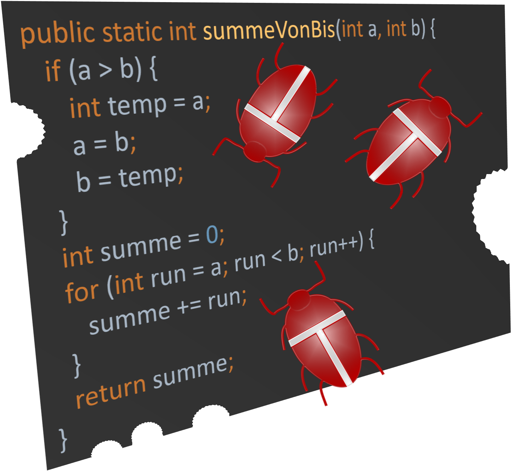
</div>

<div style="page-break-after: always;"></div>


<h2> Inhaltsverzeichnis </h2>

<!-- TOC -->

* [Bugs](#bugs)
    * ["Klassifizierung" von Bugs](#klassifizierung-von-bugs)
    * [Einen Bug finden](#einen-bug-finden)
* [Wie es nicht geht!](#wie-es-nicht-geht)
    * [Was man instinktiv tut](#was-man-instinktiv-tut)
        * [Probleme](#probleme)
    * [Etwas besser aber ...](#etwas-besser-aber-)
        * [Logging ist dennoch wichtig](#logging-ist-dennoch-wichtig)
* [Stack Trace lesen und verstehen](#stack-trace-lesen-und-verstehen)
    * [Passende Beschreibung wählen](#passende-beschreibung-wählen)
    * [Den Ort des Fehlers einschränken](#den-ort-des-fehlers-einschränken)
    * [Exception durch Exception](#exception-durch-exception)
* [Grundlagen des Debuggen mit einer IDE](#grundlagen-des-debuggen-mit-einer-ide)
    * [Debug-Modus](#debug-modus)
    * [Breakpoints](#breakpoints)
        * [Breakpoint Arten](#breakpoint-arten)
    * [Im Code vorangehen](#im-code-vorangehen)
    * [Auslesen/Manipulation des Speichers](#auslesenmanipulation-des-speichers)
        * [Auslesen](#auslesen)
        * [Manipulation](#manipulation)
    * [Frame stack](#frame-stack)
    * [Zusammenfassung](#zusammenfassung)
        * [Begriffe zum Debuggen](#begriffe-zum-debuggen)
        * [Fehlerwirkung Exception ➡️ Stack Trace](#fehlerwirkung-exception--stack-trace)
        * [Debugging](#debugging)
* [Tests](#tests)
    * [Mehr als public](#mehr-als-public)
    * [Kein private](#kein-private)
        * [Die Ausnahme](#die-ausnahme)
    * [JUnit](#junit)
        * [Testklassen/Unit-Tests schreiben](#testklassenunit-tests-schreiben)
        * [Struktur der Testklasse](#struktur-der-testklasse)
        * [assertX](#assertx)
        * [JUnit-Annotationen](#junit-annotationen)
    * [Tests in IDEs](#tests-in-ides)
        * [Übersicht der Tests](#übersicht-der-tests)
        * [Übersicht filtern](#übersicht-filtern)
* [Bibliothek](#bibliothek)
    * [Situation](#situation)
    * [Aufgabe](#aufgabe)
    * [Die Bibliothek](#die-bibliothek)
    * [Verschmutzbare Objekte](#verschmutzbare-objekte)
    * [Personal](#personal)
    * [Besucher](#besucher)
    * [Ausleihe](#ausleihe)
    * [Bücher](#bücher)
        * [ISBN](#isbn)
        * [Beschädigung](#beschädigung)
        * [Ausleihbar](#ausleihbar)
    * [Bestand](#bestand)
    * [Leseräume](#leseräume)
    * [Angestelltenverwaltung](#angestelltenverwaltung)

<!-- TOC -->

<div class="toc-pagebreak"></div>

<h1>Debug-Tutorial</h1>

<h2>Einleitung</h2>

Dies ist eine Einführung in das Thema **Debugging** und der Umgang mit IDEs damit.
Es soll anhand mehrerer kleiner Beispiele die Grundlagen, für Bugs und Debugging, verständlich beigebracht werden.
Wenn die Grundlagen abgeschlossen wurden, dann soll in einem großen Beispiel das Erlernte geübt werden.
Alle Beispiele und Erklärungen sind in Java geschrieben bzw. beziehen sich auf Java.
In anderen Programmiersprachen kann es sein, dass manche Konzepte etwas anders funktionieren.

Alle Beispiele sind in dem Projekt  [Debug-Tutorial](https://github.com/OliverGeisel/Debug-Tutorial) unter [https://github.com/OliverGeisel/Debug-Tutorial](https://github.com/OliverGeisel/Debug-Tutorial) zu finden.
Die Einführung, mit den entsprechenden Java-Dateien, ist in dem Ordner `start/src/main/java` zu finden.
Das große Beispiel, mit den entsprechenden Java-Dateien, ist in dem Ordner
`bibliothek-beispiel/src/main/java` zu finden.

Dieses Dokument ist in mehrere thematische Abschnitte unterteilt.
Zuerst wird erklärt, was ein Bug ist und wie er entsteht.
Danach wird erklärt wie ein Stack Trace gelesen und verstanden wird.
Anschließend wird erklärt, wie ein Debugger funktioniert und wie er in einer IDE genutzt wird.
Anhand einiger Beispiele wird das Debuggen mit einer IDE erklärt.
Im zweiten thematischen Abschnitt wird erklärt, wie Tests helfen können Bugs zu finden.
Zudem wird auch an einem konkreten Beispiel gezeigt, wie man die Ergebnisse von Tests nutzen kann und damit das Debugging entsprechend vereinfacht wird.
Zum Abschluss wird ein großes Beispiel vorgestellt, in dem das Debuggen und die Tests geübt werden können.

<h3>Anforderungen und benötige Werkzeuge</h3>

Weil sich dieses Projekt mit dem Debuggen mit der Hilfe von IDEs beschäftigt, wird eine IDE benötigt.
Alle Beispiele und Erklärungen in diesem Projekt werden an der IDE IntelliJ IDEA von JetBrains erklärt.
Auch andere IDEs für Java können genutzt werden.
Das sind unter anderem:

* **Eclipse**
* **NetBeans**
* **Visual Studio Code** mit Java-Plugin; Kurz VSCode oder nur Code

Zudem ist für das Einführungsbeispiel **Java 8** oder höher notwendig.
Für das große Beispiel wird **Java 21** oder höher benötigt.\

**Maven** oder **Git** sind für dieses Projekt nicht notwendig, es ist aber hilfreich.
Das Projekt besitzen einen Maven-Wrapper und kann damit mit `mvnw` alle Maven-Befehle ausführen.
Git bietet sich an, weil es einen Lösungs-Branch gibt, wo die Fehler in der Bibliothek hervorgehoben sind.

<h3>Ziele</h3>
Die Ziele dieses Projektes sind:

* Die Notwendigkeit von Debugging zu verstehen
* Was ein Bug ist und wie er entsteht
* Wie ein Debugger funktioniert
* Wie ein Debugger in einer IDE funktioniert
* Wie Tests beim Debuggen helfen
* Ein paar "neuere" Funktionen in Java erkunden

In mehreren Kapiteln gibt es Aufgaben, die das Konzept oder die Funktionalität durch üben am Einführungsbeispiel oder am großen Beispiel festigen sollen.
Im Repository gibt es zudem ein [CheatSheet](CheatSheet.md) und eine [Checkliste](Lernzettel.md), die als Hilfe dienen sollen.

<hr>

## Bugs

Bugs ist ein allgemeiner Begriff für **Fehler** in der Informatik/Programmierung.
In der Programmierung sind Bugs oft **Laufzeitfehler** bzw. ein **Fehlerzustand**.
Dieser Zustand ist unerwünscht und führt zu einer **unerwünschten Folge**.
Dieser Zustand muss aber erst erreicht werden.
Nur wenn das Programm ausgeführt und eine **Handlung** geschieht, wird die **Auswirkung** erreicht.
Jeder Bug wird also erst durch eine **Ursache** zum Bug.
Die Ursache kann aber nur zur Laufzeit auftreten.
Würden wir das Programm nie ausführen, könnte nie eine Wirkung eintreten, allerdings existiert der Bug immer im Programm bzw. Quellcode \
Es gibt also eine Handlung (Ursache), die durch einen Fehlerzustand (Bug) und zu einer ungewünschten Folge (Wirkung) führt.
Leider wird auch gerne mal die Ursache als Bug bezeichnet und kann damit zur Verwirrung führen.
Die Begriffe, die sich dafür in der Industrie genutzt werden, lauten etwas anders und können
bei [ISTQB/GTB](https://www.german-testing-board.info/lehrplaene/istqbr-certified-tester-schema/entwicklungstester/) oder [IEEE](https://ieeexplore.ieee.org/document/5399061) nachgelesen werden.
Im weiteren Verlauf des Textes bleiben wir jedoch bei den "einfacheren" Begriffen Ursache bzw. Handlung, Bug bzw. Fehler und Wirkung.
Der Begriff **Debugging** bezeichnet also die Beseitigung Fehlern oder Bugs.

### "Klassifizierung" von Bugs

Ein Bug kann in verschiedenen Formen auftreten.
Mögliche Formen sind unter anderem:

* Syntax - ein Zeichen vergessen oder zu viel

```jshelllanguage
if(a>5{ // Syntax - schließende Klammer fehlt --> Fehlerwirkung: Das Programm kann nicht kompiliert werden 
	System.out.println("Hallo Welt");
} 
```

Hier wäre die Ursache das Compilieren des Programmes.

* Semantik - Interpretation ist falsch/ `>` statt `<` als Vergleich

```Jshelllanguage
if (a <= 5) { // Semantik - Vergleich ist falsch --> Fehlerwirkung: Falsche Ausgabe
	System.out.println("A ist größer oder gleich als 5");
} else {
	System.out.println("A ist kleiner als 5");
}
```

Die Ursache ist hier, dass zur Laufzeit der Vergleich falsch ist. Es wird ausgewertet zur Laufzeit, aber in der falschen Richtung.

* Logik - Abfolge des Programmes in falscher Reihenfolge

```Jshelllanguage
String s;
	s.equals("Hallo Welt"); // Logik - s ist nicht initialisiert --> Fehlerwirkung: NullPointerException
```

Der Fehler ist hier, dass die Variable `s` nicht initialisiert wurde.
Die Ursache ist der Aufruf der Methode `equals` auf der Variable `s`.


> Ob jetzt die Ursache oder der Fehler in diese Formen eingeteilt wird, ist nicht wichtig. Es geht nur darum, dass es verschiedene Möglichkeiten gibt, wie ein Bug auftreten kann.
> Und es verschiedene Auslöser gibt, die zu einem Bug führen können.

### Einen Bug finden

Bugs kündigen sich (zur Laufzeit) nicht an.
Sie können nur durch die Fehlerwirkung bemerkt werden.
Allgemein gesagt gibt es zwei Möglichkeiten, wie ein Bug bemerkt werden kann.

1. Ein falsches Ergebnis wurde ausgegeben
2. Eine Exception/Absturz des Programmes trat auf

Beide Varianten werden in diesem Projekt vorgestellt.
Im Beispiel "summeVonBis" wird ein falscher Wert ausgegeben.
Die zweite Variante wird primär in den darauffolgenden Beispielen behandelt.
Leider kann besonders die erste Variante sehr schnell übersehen werden, weshalb genau dafür **Tests** existieren.
Deshalb wird im zweiten Teil dieser Einführung das Thema '[Tests](#tests)' behandelt.

Die zweite Möglichkeit (Exceptions) ist leichter zu bemerken, da sie zu einem Anhalten des Programmes führt.
Oft steht auch noch die Nachricht in der Fehlerausgabe.
Wie diese Nachricht zu interpretieren ist, wird im folgenden Kapitel ["Stack trace lesen und verstehen"](#stack-trace-lesen-und-verstehen) erklärt.

<hr>

## Wie es nicht geht!

In der Datei [`Breakpoint.java`](start/src/main/java/Breakpoint.java) ist eine Funktion `summeVonBis(a, b)`.
Diese Funktion soll die Summe von a bis b (inklusive beider Zahlen) zurückgeben.
Jedoch ist ein Fehler in dem Programm und das Ergebnis ist falsch.
Dementsprechend schlagen die dazugehörigen Tests (`start/src/test/java/BreakpointTest.java`) fehl.
Es wurde also durch die Fehlerwirkung bemerkt, dass ein Bug im Programm ist.
Analysiert man jetzt den Code, so findet man ziemlich schnell die Fehlerstelle.
Doch um zu verstehen, wozu ein Debugger gebraucht wird, sei jetzt mal angenommen der Fehler wird nicht auf den ersten Blick gefunden.

```Java
public class Breakpoint {

	public static int summeVonBis(int a, int b) {
		if (a > b) {
			int temp = a;
			a = b;
			b = temp;
		}
		int summe = 0;
		for (int run = a; run < b; run++) {
			summe += run;
		}
		return summe;
	}
	//...
}
```

### Was man instinktiv tut

Wenn der Fehler nicht ersichtlich ist, würde ein erster Gedanke sein, die Werte, die sich in der Schleife verändern, auf
der Konsole auszugeben.
Das wäre beispielsweise ```System.out.println("run ist: " + run);```.
[`BreakpointPrint.java`](start/src/main/java/BreakpointPrint.java) zeigt eine Möglichkeit, wie
`print` zur Fehlersuche genutzt werden kann.\
In der Konsole fällt auf, dass "run" höchstens 6 ist.
Damit fehlt ein Durchlauf und es ist klar, wo der Fehler ist.
Er ist im Schleifenkopf.
Es handelt sich um einen sogenannten "Off by one"-Fehler.
Das bedeutet, das große Ganze ist korrekt, nur ist die Berechnung ist um eins falsch.
Eine Lösung wäre demnach entweder die Bedingung in ```i < b + 1``` oder ```i <= b``` zu ändern.

#### Probleme

Zwar wurde der Fehler gefunden und behoben, aber es gibt einige Probleme mit dieser Vorgehensweise.
Für jede Variable, die ausgegeben werden soll, muss eine print-Anweisung zum entsprechenden Zeitpunkt im Code geschrieben werden.
Zudem sind alle print-Anweisungen mit extra Informationen zu versehen, damit der Entwickler überhaupt weiß, welche
Variable jetzt ausgegeben wurde.
Diese Anweisungen müssen nach dem Beseitigen des Fehlers aber wieder entfernt werden.
Ansonsten stehen unnötige und vlt. sogar verwirrende Zeilen in der Ausgabe, wenn das Programm normal genutzt wird.\
Diese Lösung ist für kleine Beispiele noch vertretbar.
Wenn jedoch Projekte mit tausenden Zeilen Code einen Fehler haben, dann ist diese Lösung sehr suboptimal.
Da überall print-Statements gesetzt werden müssen, ist der Code damit überschwemmt und nachdem der Fehler behoben
wurde müssen alle print-Statements entfernt werden und dabei können leicht Anweisungen übersehen werden.\

Ein weiteres Problem ist, dass das Programm durchläuft und nicht angehalten werden kann.
Es muss die gesamte Ausgabe durchsucht und verstanden werden, um zu wissen, was an welcher Stelle passiert ist.
Es wäre also gut auf Wunsch anzuhalten und dann Schritt für Schritt voranzugehen.
Das Könnte mit einer Input-Abfrage an bestimmten stellen programmiert werden, aber auch das muss am Ende wieder entfernt werden.

Das nächste Problem ist, dass die Werte während der Ausführung nicht verändert werden können.
Das klingt erst mal nutzlos, es gibt aber Situationen, in denen man zu Testzwecken den Wert einer Variable ändern möchte,
um ein anderes Verhalten als normal zu erhalten.
Des Weiteren ist die Übersicht, durch die vielen Ausgaben, sehr schwer.
Eine Filterung der Ausgaben muss deshalb mit programmiert werden.

### Etwas besser aber ...

Zumindest zwei Probleme lassen sich mit **Loggern** lösen.
Durch Logger kann die Filterung deutlich einfacher programmiert werden.
Ein Logger ist ein Objekt, dass Informationen über den Programmablauf aufnimmt und diese in einer Datei oder auf der Konsole ausgibt.
Auch durch die Nutzung mehrerer Logger bzw. durch die Nutzung der verschiedenen
**Level** ist die zusätzliche Information und Filterung kein Problem mehr.

#### Level von Loggern

Logger haben verschiedene Level, die angeben, wie wichtig eine Information ist.
Und es gibt noch mehr verschiedene Logging-Frameworks, die ihre Level anders benennen.
Level, die es im Allgemeinen gibt, sind:

* **DEBUG** - Debugging-Informationen, die nur für das Debuggen wichtig sind
* **INFO** - Allgemeine Informationen, die für den Nutzer wichtig sind
* **WARN** - Warnung, dass etwas nicht ganz richtig ist, aber das Programm weiterläuft
* **ERROR** - Fehler, der das Programm nicht zum Absturz bringt, aber dennoch nicht richtig ist
* **FATAL** - Schwerwiegender Fehler, der das Programm zum Absturz bringt

Durch eine Konfiguration kann festgelegt werden, welche Level zur Laufzeit ausgegeben werden sollen.
Im Normalfall ist es so, dass nur die Level INFO, WARN und ERROR ausgegeben werden.
Debug-Informationen werden nur ausgegeben, es explizit so konfiguriert ist.\
Ein Beispiel für das Nutzen eines Loggers ist in der Datei [
`BreakpointLogging.java`](start/src/main/java/BreakpointLogging.java) zu finden.
Dort wurde der Logger vom JDK genutzt.\
Die Ausgabe ist ähnlich zu der Ausgabe von der print-Variante, aber es gibt einige Vorteile, die es leichter machen, den Fehler zu finden.

#### Es bleiben Probleme

Doch es bleiben die Probleme, dass wenn ein Fehler im Code ist, zuerst zusätzlicher geschrieben werden muss, um Informationen während der Laufzeit zu erhalten.
Außerdem ist nicht gesagt, dass dieser Code nicht am Ende (gegebenenfalls) wieder entfernt werden muss.\
Zudem ist das Programm nicht immer noch nicht unterbrechbar bzw. auf Wunsch kann die Ausführung angehalten werden.
Der Vorteil von Loggern zu Print ist, also nur eine schöne Ausgabe, die gefiltert werden kann?
Nein!
Das ist nicht das Ziel von Logging.

#### Logging ist dennoch wichtig

Logging ist eine Hilfe zum Debuggen.
Allgemein sollte Logging im Projekt genutzt werden.
Allerdings nicht zum Debuggen, sondern um den Ablauf des Programmes zu überwachen und um Fehler zu protokollieren.
So sollte jede Exception in einem Log stehen und mit dem richtigen Level versehen sein.
Jedoch hilft Logging beim Debugging nur die Ursache bzw. den Ort des Fehlers zu finden, wenn das Log informativ ist.
Die Wahl des Logging-Levels und der mitgelieferten Informationen sollten deshalb gut gewählt sein.\
Logging sollte aber eben **nicht nur genutzt** werden, um einen Fehler zu finden und nach dem
Beheben des Fehlers das Logging **wieder zu entfernen**.
Logging ist eine dauerhafte Hilfe, die in jedem Projekt genutzt werden sollte.

<hr>

## Stack Trace lesen und verstehen

Im vorherigen Kapitel wurde der Fehler bzw. die Fehlerwirkung direkt durch print-Statements oder Logger angezeigt.
Das kann schnell übersehen werden.
Zum "Glück" gibt es aber auch eine andere Form der Fehlerwirkung.
Eine die etwas unschöner ist, aber dafür auch mehr Informationen gibt.
Das ist die (unbehandelte) **Exception**.\
Wenn eine nicht gefangene Exception in Java auftritt, dann wird ein sogenannter **Stack Trace** ausgegeben.
Dieser enthält 4 wichtige Informationen:

1. Name des Threads in dem die Exception auftrat
2. Typ der Exception
3. Beschreibung/Grund der Exception
4. "Trace" bzw. Call Stack

Die vier Bestandteile sollen mit dem Beispiel in der Datei [ExceptionBeispiele.java](start/src/main/java/ExceptionBeispiele.java) erklärt werden.
In dem Beispiel werden 4 verschiedene Exceptions geworfen.
Die Wahl der Exception geschieht durch das übergebene Programmargument.
Startet man das Programm mit dem Argument "0", so wird eine `NullPointerException` geworfen.
Der Stack Trace sieht dann wie folgt aus:

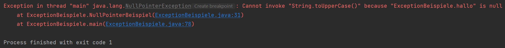

<p style="background-color: #ffe877; border-left: 6px solid #2196F3; padding: 10px;">
Nicht jede Programmiersprache hat einen Stack Trace. 
In C ist es so, dass es keinen Stack Trace gibt, weil es auch keine Exceptions gibt. 
Zwar ist die Ausführung in C deutlich schneller, weil es keine Exception-Handler gibt, jedoch ist das Debuggen deutlich schwerer. 
</p>

### Passende Beschreibung wählen

Der **Name des Threads** ist bei Single-Threaded-Anwendungen immer der _main_-Thread (Java).
Der Name ist nur wichtig, wenn die Anwendung mehrere Threads nutzt.\
Der **Typ** der Exception ist schon wichtiger.
Er soll eine grobe Einordnung geben, wieso der Fehler auftrat.
Deswegen sollten auch immer die Typen der Exception gut gewählt und beschreibend sein.\
Die konkrete Information, warum der Fehler auftrat, soll dann die **Beschreibung** der Exception geben.
In
`ExceptionBeispiele.java` ist das zweite Beispiel (Argument "1") eines, welches keine Informationen über die Stelle des Fehlers gibt.
Es wurde eine `RuntimeException` geworfen und als Grund "Es ist ein Fehler aufgetreten" ausgegeben.
Gut so schlau war man schon vorher, dass ein Fehler aufgetreten ist, das Programm ist ja abgestürzt.
Der Informationsgehalt ist also gleich null.
Deshalb sollte immer gut überlegt werden, welche Exception geworfen wird und welche Information mitgegeben wird.

Wie sieht jetzt eine gute Beschreibung aus?
Beispielsweise gibt es in der Datei
`ExceptionBeispiele.java`, wenn man die Anwendung mit dem Argument "2" startet, einen
Stack Trace der eine ```NoSuchElementException``` wirft und als Grund "No value Present!" ausgibt.
Beide Informationen zusammen sagen, dass ein bestimmtes Element gesucht wurde (Exception), es aber nicht gefunden wurde,
weil in dem genutzten Objekt kein Wert verfügbar war (Grund).
Das lässt darauf schließen, dass irgendwo ```null``` einer Variable zugewiesen worden sein muss.

### Den Ort des Fehlers einschränken

Der Type und der Grund der Exception sind eine große Hilfe, um zu verstehen, warum der Fehler auftrat.
Doch sie geben nicht den Ort der Exception an.
Die Information, in welcher Zeile die Exception geworfen wurde, steht im "**Trace**"
<p style="background-color: #a4ff98; border-left: 6px solid #2196F3; padding: 10px;">
    Offiziell gibt es keine Bezeichnung dafür. 
Es sind viele <i>StackTraceElemente</i>, die alle etwas repräsentieren. 
Wenn keine weitere Exception geworfen wurde (siehe weiter unten), ist er identisch zum call stack, der auch execution stack genannt wird, zu dem
Zeitpunkt, als die Exception auftrat. 
Der Name wird hier verwendet, um eine Bezeichnung dafür zu haben.
</p>

Der Trace ist eine Liste von Zeilen, die alle aufeinander aufbauen.
Konkret zeigt es, welche Methode von welcher Methode aufgerufen wurde (mit Zeile im Quellcode).

Die wichtige Information steht dabei **nicht** am Ende des Trace, sondern ganz oben.
Direkt nach dem Grund der Exception.
Dies ist die Stelle, an der die Exception geworfen wurde.
In dem zuvor genannten Beispiel (ExceptionBeispiel mit Argument 2) ist es die Zeile 143 in der Klasse Optional des JDK.
Dort findet man auch die entsprechende Zeile ```throw new NoSuchElementException("No value present!");```.\
Das sagt uns jetzt aber nur wo sie geworfen wurde.
Das ist aber nicht die Zeile, die den Fehler enthält.
Deshalb muss eine Zeile weiter unten im "Trace" geschaut werden.
Dort sieht man, dass in _Zeile 24_ der `ExceptionBeispiele.java` in der
Methode `tiefeException` der Aufruf des Optionals war.
Da man im Normalfall davon ausgehen kann, dass die Klassen im JDK korrekt sind, muss der Fehler in der Nähe dieser
Zeile 24 liegen.\
Eine weitere Hilfe bietet hier die JavaDoc von ```Optional.get()```.
In dieser steht, dass die Exception nur geworfen wird, wenn der Wert innerhalb des Optionals ```null``` ist.
Wenn jetzt an die Stelle im Code angesehen wird, dann ist ein paar Zeilen darüber
```Optional.ofNullable(null)``` zu lesen.
Damit ist der Fehler gefunden.

### Exception durch Exception

Das letzte Beispiel der `ExceptionBeispiele.java` ist etwas schwerer (Argument "3").
Hier wird eine Exception geworfen, die durch die Behandlung einer Exception verursacht wurde (Siehe Zeile 51 in der Datei
`ExceptionBeispiele.java` innerhalb der catch-Klausel).

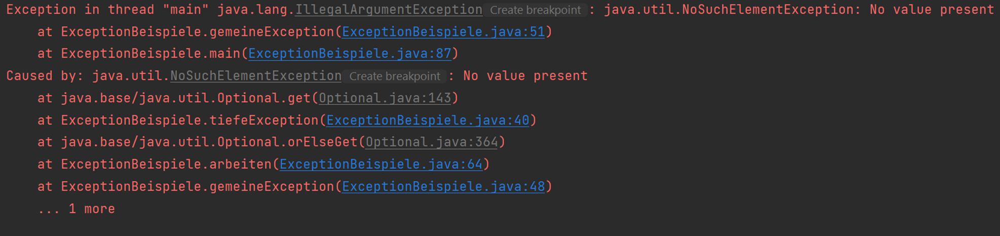

Der Grund für die "oberste" Exception im Trace, ist die Exception, die weiter unten im Trace steht.
Sie wird markiert mit "Caused by".
Den Fehler hier zu finden ist deutlich schwerer und benötigt etwas Bedenkzeit.
Jedoch lässt sich der Fehler auch finden, wenn die verursachende Exception analysiert wird.
Wieder ist es eine ```NoSuchElementException``` und wieder ist es das ```Optional.get()```.
Es muss also wieder irgendwie mit dem Optional zu tun haben.

> Je nach IDE sind gewisse Bereiche des Stack Traces farblich markiert.
> In diesem Beispiel hebt IntelliJ projektfremde Zeilen Grau hervor.
> Zeilen, die zum eigenen Projekt gehören, sind Blau markiert.
> Zudem werden noch die Funktionalitäten wie das Setzen von Breakpoints an den entsprechenden Stellen, wo die Exception geworfen wurde, oder an die Stelle im Code springen, die im Call-Stack markiert ist, angeboten.


**Aufgabe:** Führen Sie die `ExceptionBeispiele.java` aus und probieren Sie in allen Fällen die Fehler zu finden.\
*Hinweis!* Das Beispiel mit dem Programmargument 1 ist nur ein Demonstrationsbeispiel, wie Exceptions nicht aussehen
sollten.

<hr>

## Grundlagen des Debuggen mit einer IDE

Die letzten beiden Kapitel haben uns gezeigt, dass wir immer Informationen brauchen, um den Fehler zu finden.
Diese Informationen können wir entweder durch Exceptions oder durch print-Statements bzw. Logger erhalten.
Allerdings ist das Problem, dass wir in beiden Fällen das Programm normal laufen lassen müssen.
Weil Änderungen direkt am Code nicht ideal sind, um Fehler zu finden, muss eine andere Lösung gefunden werden.
Anstatt das Programm normal laufen zu lassen, wäre es schön das Programm in eine Umgebung zu setzen, in der der
Nutzer bestimmt, wann etwas geschieht und alle Geschehnisse überwachen zu können.
Genau das macht ein **Debugger**.
Ein Debugger ist also ein Programm, das ein anderes Programm ausführt und dabei die Möglichkeit gibt, den Ablauf des Programmes zu steuern und zu überwachen.

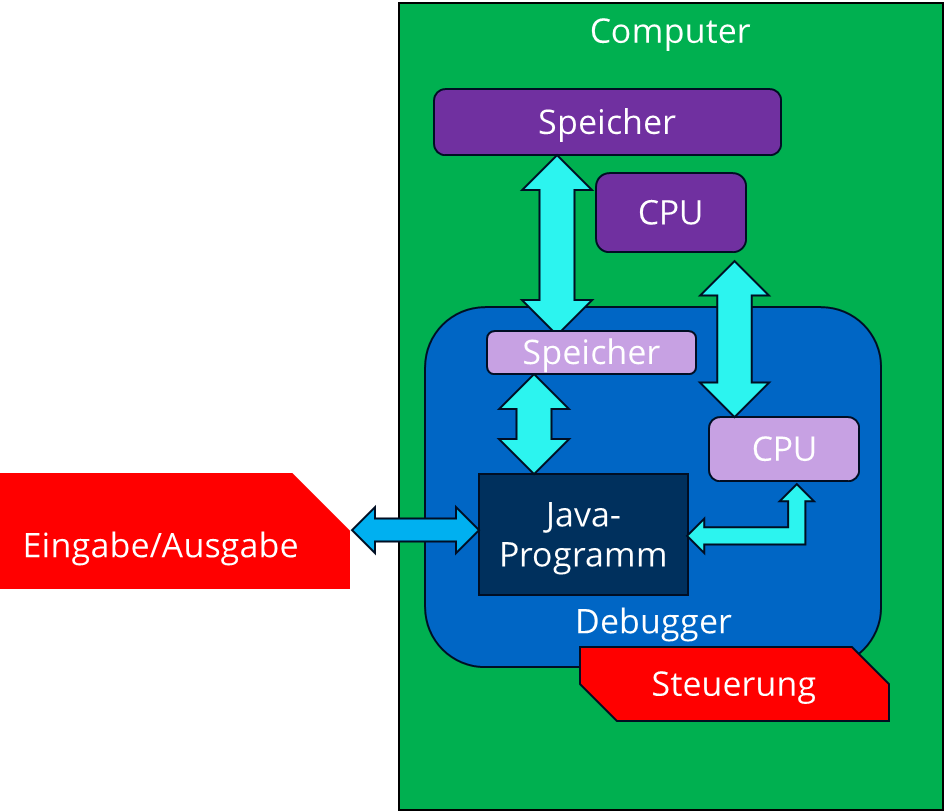

In der Abbildung ist eine vereinfachte Darstellung eines Debuggers zu sehen.
Der Debugger klemmt sich zwischen das Programm und dem Betriebssystem.
Dieser simuliert für das Programm das Betriebssystem und kann so in den Ablauf des Programmes eingreifen und die Werte der Variablen und Objekte überwachen.

> Die wirkliche Funktionsweise eines Debuggers ist deutlich komplexer.
> Es ist eine enge Zusammenarbeit zwischen dem Betriebssystem, der Programmiersprache und dem Debugger notwendig.
> Der Debugger nutzt spezielle Systemaufrufe, um das Programm zu starten und zu steuern.
> Das ist aber nicht Teil dieses Projektes und soll hier nicht weiter behandelt werden.
> Deshalb ist in dem Schema innerhalb des Debuggers ein weiterer Speicher bzw. CPU zu sehen.

### Debug-Modus

Bei Java ist ein Debugger im JDK enthalten.
Dieser lässt sich über die Kommandozeile starten.
Der Debugger heißt **Java Debugger** und wird mit dem Befehl `jdb` gestartet.
In der folgenden Abbildung ist ein Beispiel zu sehen, wie der Debugger auf der Kommandozeile das Programm
`BreakpointPrint.java` debuggt.

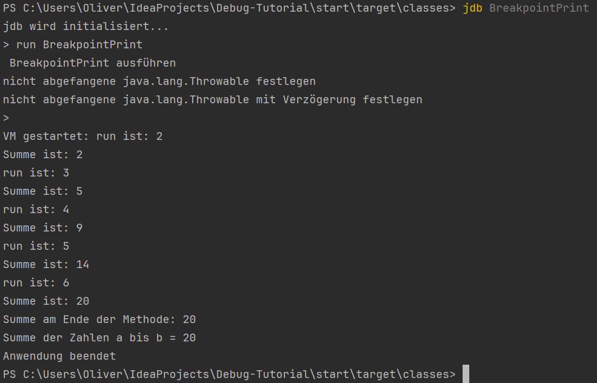

Es ist zu sehen, dass der Debugger gestartet wurde und das Programm `BreakpointPrint` geladen wurde.
Danach läuft das Programm bis zum Ende durch und gibt die bereits bekannten Ausgaben aus.
Der Debugger ist ein reines Kommandozeilen-Programm.
Das bedeutet alles muss über die Eingabe von Befehlen gesteuert werden.
Allerdings ist das sehr unbequem zu handhaben.
Die ganzen Funktionen, die wir noch kennenlernen, müssen über Befehle entsprechend übergeben bzw. gesteuert werden.
Deshalb haben viele IDEs einen **Debug-Modus**.
Dieser startet den Debugger im Hintergrund, erlaubt aber die leichte Steuerung und schöne Darstellung des zu debuggenden Programmes innerhalb der IDE.
Dieser Modus ist oft langsamer, als der normale Modus, was aber logisch ist, weil der Debugger ja noch zusätzliche Arbeit leisten muss.
Allerdings ist der Unterschied in der Regel nur in wenigen Situationen bemerkbar.
Performanz sollte jedoch nicht im Debug-Modus getestet werden.\
In IDEs ist der Debug-Modus durch das Klicken auf einen extra Button (meist ein Käfer-Symbol) startbar.
Überwiegend ändert sich dabei nur die Ansicht in der IDE oder ein extra Fenster erscheint.

**Aufgabe:**
Finden Sie diesen Button zum Starten des Debug-Modus in ihrer IDE.
Hier kann wieder die Datei `Breakpoint.java` genommen werden.

### Breakpoints

Wenn der Debug-Modus gestartet wurde, dann sollte nichts besonders passieren.
Lediglich in der Konsole stehen zwei zusätzliche Zeilen.
Das liegt daran, dass der Debugger nicht weiß, wann er eingreifen soll.
So läuft das Programm einfach ganz normal im Debugger bis zum Ende.\
Beim Debuggen ist es aber wichtig zu wissen, wann erreichen wir die Fehlerwirkung, also wann haben wir den Bug ausgelöst und haben ungewollte Ergebnisse.
Bzw. wir wollen wissen bis wohin noch alles in Ordnung ist.
Dazu sollte das Programm an bestimmten Stellen anhalten können, wo überprüft werden kann, wie die Werte sind.
Es wird also eine Markierung benötigt, die dem Debugger sagt: "Hier bitte halten!"
Das erledigt ein **Breakpoint**.

Breakpoints sind Haltepunkte im Code, die der Entwickler selbständig setzt.
Sie werden gesetzt, indem man links neben Zeile im Programmcode einfach oder doppelt klickt.
Dort sollte dann eine Markierung auftauchen.
Dies ist dann ein _gesetzter Breakpoint_.
Wird nun das Programm im Debug-Modus gestartet, dann läuft das Programm normal bis an die Stelle, wo der Breakpoints ist.
**Wichtig!** Ein Breakpoint hält **vor** der markierten Zeile.
Die markierte Zeile wurde also noch nicht ausgeführt.

Breakpoints lassen sich beliebig an und ausschalten oder auch wieder entfernen.
Ein Breakpoint ist ausgeschaltet, wenn er (je nach IDE) ausgegraut oder durchgestrichen ist.
Viele IDEs besitzen eine Breakpoint-Übersicht, in der listenartig steht, wo welcher Breakpoint ist und ob dieser
aktiviert ist.

**Aufgabe:**
Setzen Sie an den Anfang eines Programms (z.B. `Breakpoint.java`) einen Breakpoint und starten Sie den Debug-Modus.
Das Programm sollte an dieser Stelle halten und die Fenster, des Debug-Modus, sollten nun weitere Fenster anzeigen, als sonst.

#### Breakpoint Arten

Der normale Breakpoint ist ein **Line-Breakpoint**.
Dieser hält in der bzw. vor der markierten Zeile.
Es gibt aber auch andere Arten von Breakpoints, die für spezielle Situationen vorteilhaft ist.\
Seit Java 8 gibt es auch **Lambda-Ausdrücke**.
Das sind anonyme Funktionen, die auch als ein Objekt behandelt werden können und Variablen zugeordnet werden können und damit auch als Parameter für Methoden diesen können.
Z.B. die nur für den Lambda-Ausdruck einer Zeile hält.
Oft sind diese Lambda-Ausdrücke sehr kurz und werden oft direkt als Parameter in den Methodenaufruf geschrieben.
Damit sind normale Breakpoints etwas unpassend.
Dafür haben einige IDEs **Lambda-Breakpoints**.
Dies Breakpoints halten nur an der Stelle, wo der Lambda-Ausdruck aufgerufen wird.\
Auch normale Methoden können einen Breakpoint besitzen.
Diese Breakpoints werden in der Zeile des Methodenkopfes gesetzt.
Jedoch können **Methoden-Breakpoints** das System sehr verlangsamen und sollten deswegen nur begrenzt eingesetzt werden.
Der Grund liegt darin, dass der Debugger vor jedem Aufruf der gewählten Methode anhalten muss.
Das kann er aber nicht wissen, weil der Debugger nicht weiß, ob die Methode aufgerufen wird.
Deshalb muss er ständig prüfen, ob die Methode aufgerufen wird.
Ein normaler Line-Breakpoint in der ersten Zeile des Rumpfes funktioniert in 90 % aller Fälle genauso.\
Die letzte Art sind **bedingte Breakpoints**.
Diese können beispielsweise bei einem Schleifendurchlauf erst nach fünfmaligem passieren aktiv werden und eben erst den sechsten Lauf pausieren.

> Je nach IDE gibt es noch weitere Arten von Breakpoints.
> Die vorgestellten Arten werden von IntelliJ IDEA unterstützt.


**Aufgaben:**

1. In der Datei [`BreakpointArten.java`](start/src/main/java/BreakpointArten.java) ist eine Methode mit Kommentaren.
   Diese Kommentare beschreiben die Breakpoint Arten.
   Setzen Sie diese in die entsprechende Zeile ein.
   Testen Sie die Breakpoints.

2. Für bedingte-Breakpoints gibt es eine extra Datei.
   In [`BreakpointBedingung.java`](start/src/main/java/BreakpointBedingung.java) ist es das Ziel sich Pi zu näheren.
   Jedoch ist ein Fehler im Programm.
   Um zumindest das letzte Ergebnis vor dem Fehler zu erhalten, soll der Breakpoint nur vor dem Ausführen der bösen Aktion
   halten.
   Es könnte auch anders gelöst werden, jedoch soll hier ein bedingter Breakpoint genutzt werden, der nur ein mal hält und
   sonst ignoriert wird.
   Die entsprechende Zeile ist im Code mit einem Kommentar markiert.

### Im Code vorangehen

Wenn ein Breakpoint erreicht wurde, dann hält das Programm an.
An dieser Stelle kann der Entwickler nun den Code untersuchen und die Werte der Variablen ansehen.
Das ist im Kapitel [Auslesen und Manipulation](#auslesenmanipulation-des-speichers) beschrieben und wird vorerst übersprungen.
Weil das Programm angehalten hat, kann der Entwickler entscheiden, wie es jetzt im Code weiter gehen soll.
Es gibt viele verschiedene Möglichkeiten im Code voranzukommen.
Die gängigsten Möglichkeiten sind:

- **Step over** → führe den nächsten Befehl aus. Nur diesen einen.
- **Step into** → springt in die nächste Methode hinein und hält dort an der ersten Zeile.
  Wenn es keine Methode gibt, dann ist es die nächste Zeile oder Anweisung.
  (Äquivalent zu Step Over dann)
- **Step out** → Gegenteil zu **step into**.
  Spring aus der Methode und landet in der Methode die im Stack "darunter" liegt.
  Die "ursprüngliche" Methode wird dabei vollständig bis zum Ende/return ausgeführt.
- **Continue** → führt das Program so lange fort, bis der nächste Breakpoint erreicht ist.

Weitere Optionen, die aber nur manche IDEs haben, sind:

- **Run to Cursor** → Das Programm läuft bis zur aktuellen Cursor-Position weiter, oder zum nächsten Breakpoint.
- **Drop Frame** → Dies verwirft die momentane Methode und "setzt sie zurück".
  Es startet also die aktuelle Methode neu.
  Dabei können aber Änderungen, die Objekte außerhalb der Methode betreffen, erhalten bleiben und so das Programm kaputt
  machen.

> Wichtig!\
> Bei Step Over wird das nächste Statement ausgeführt, aber nicht in die Methode hineingesprungen.
> Sollte in der Methode jedoch ein Breakpoint sein, dann wird das Programm dort anhalten.


**Aufgabe:**
Finden Sie die genannten Möglichkeiten in der IDE ihrer Wahl.
Die Datei `Breakpoint.java` kann dabei helfen die Funktion dieser Buttons zu verstehen.

Zu finden ist:

- Step over
- Step into
- Step out
- Continue

Optional:

- Run to Cursor
- Drop Frame

### Auslesen/Manipulation des Speichers

Wenn ein Breakpoint erreicht wurde bzw. das Programm anhält, so können alle Objekte und Variablen, die zu dieser Zeit existieren eingesehen
und manipuliert werden.

#### Auslesen

Im Normalfall sollte im Debug-Modus ein "Variablen"-Fenster auftauchen.

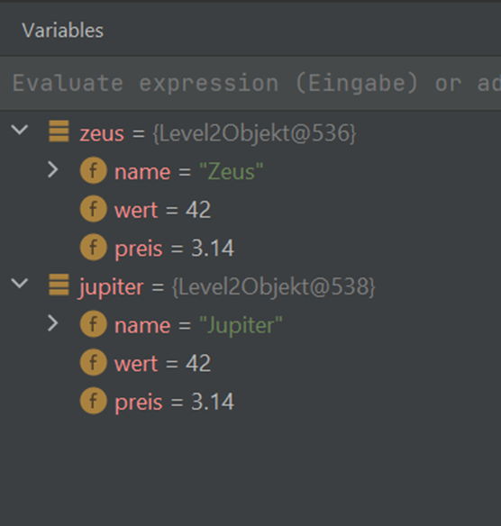

In diesem sind Bezeichnungen wie _this_, _args_ usw. zu finden.
Das sind die momentanen Objekte, die in dem aktuellen Scope genutzt werden können.
Alle Objekte, die aus mehreren Attributen bestehen, können auch diese in dem Variablen-Fenster angesehen werden (Siehe Bild).
Im Bild ist z.B. das Objekt "Zeus" zu sehen.
Dieses enthält das Attribut name, wert und preis.
Hinter Zeus steht zudem `= {Level2Objekt@536}`.
Dies ist der Wert der `toString()`-Methode.
Es ist also sinnvoll die
`toString()`-Methode zu überschreiben, damit die Objekte im Variablen-Fenster besser lesbar sind.

#### Manipulation

Manchmal ist es sinnvoll die Objekte während des Debugging zu ändern.
Damit kann beispielsweise ein ```assert condition;``` geprüft werden.
Eine andere Möglichkeit wäre es in einem if-Statement die Variablen in der _Condition_ zu ändern und damit
in den anderen Zweig zu gehen, als eigentlich vorgesehen.
Leider lassen sich nicht alle Variablen ändern.
Variablen/Attribute, die mit ```final``` gekennzeichnet sind, können nicht geändert werden.
Auch ein Debugger kann das nicht umgehen.

> Es gibt einen Weg auch final zu umgehen, mit Reflection, aber das ist nicht Teil dieses Projektes und sollte auch nicht genutzt werden.

**Aufgabe:**
Öffnen Sie `WerteManipulation.java`.
Dieser Code darf **nicht** verändert werden.
Wählen Sie ein Level durch die Angabe eines zusätzlichen Programmargumentes.
Ziel ist es das Level zu absolvieren, indem durch den Debugger die Werte der Variablen geändert werden.
Ein Level ist geschafft, wenn am Ende "Glückwunsch! Du hast Level X abgeschlossen!" auf der Konsole ausgegeben wird.\
**Achtung!** Level 4 ist sehr schwer und benötigt deswegen etwas an Überlegung.

### Frame stack

Ein weiteres Fenster sollte "Frames" oder ähnlich heißen.
Dort sollte als Erstes die momentane Methode auftauchen und darunter alle aufgerufenen Methoden stehen.
Die letzte Methode müsste die Main-Methode sein.
Das ist ziemlich ähnlich wie der Call Stack, der bei einer Exception ausgegeben wird.

In Java werden alle Methoden in **Frames** realisiert.
Diese Frames haben neben den Argumenten der Methode, sowie den lokalen Variablen noch die Rücksprungadresse und ein paar andere Objekte.
Diese Frames werden in einem Stapel (Stack) abgelegt.
Das "oberste Element" ist dabei immer die Methode, die aktuell ausgeführt wird.
Der darunter liegende Frame ist die Methode, die die aktuelle Methode aufgerufen hat usw.
Weil ein Frame alle Informationen besitzt, können auch alle Argumente und lokalen Variablen gelesen und verändert werden, auch wenn sie gerade
nicht im Scope der aktuell ausgeführten Methode sind.

**Aufgabe:**
In der Datei `FrameStack.java` ist eine Klasse mit drei Methoden, die alle eine lokale Variable "a" besitzen.
Gehen Sie schrittweise von der ersten Methoden bis zur Letzten!
Wenn Sie die tiefste Methode erreicht haben, nutzen Sie das Frame-Fenster um den Wert der "a" Variable in
der "höchsten Methode" (erste aufgerufene Methode) zu ändern.
Kehren Sie dann zu der Methode, in der das Programm hält zurück und gehen sie im Programm voran.
**Beobachten Sie das Variablen-Fenster über die ganze Zeit!**
**Hinweis** Das ist eine fortgeschrittene Aufgabe und benötigt etwas Übung.
Sie ist nicht zwingend notwendig.
Es hilft aber um die Funktionsweise bzw. Möglichkeiten des Debuggers zu verstehen.

### Zusammenfassung

Bis hier hin wurden die Grundlagen des Debuggens mit einer IDE erklärt.
Es gibt noch viele weitere Funktionen, die in einer IDE genutzt werden können.
Das geht allerdings über den Rahmen dieses Projektes hinaus.
Die Inhalte, die hier behandelt wurden, sollten aber ausreichen, um die meisten Bugs zu finden und zu beheben.
Deshalb hier noch einmal die wichtigsten Punkte zusammengefasst.
Eine Hilfe sind auch die beiden Dateien [CheatSheet.md](CheatSheet.md) und [Lernzettel.md](Lernzettel.md).

> Es gibt noch ein paar weitere Informationen zum Thema Debuggen in der pdf-Datei bzw. Präsentation, die im Projekt hinterlegt sind.
> Es lohnt sich diese zu lesen.
> Es gibt auch in den Notizen der Präsentationen noch weitere Informationen, die hier nicht behandelt wurden.

#### Begriffe zum Debuggen

* Bug - Fehlerzustand. Das Programm befindet sich in einem unerwünschten Zustand.
* Ursache - Handlung/Grund, die zu einem Bug führt. Dies eine Handlung/Eingabe von der Welt
* Fehlerwirkung - Die Folgen eines Bugs. z.B. Ein falscher Wert oder ein Absturz des Programmes.
* Debugging - Die Suche nach der Stelle eines Bugs.
* Test - Eine Methode, um Fehlerwirkungen zu finden/wahrzunehmen. Tests beseitigen Bugs nicht, sie bemerken sie nur.

#### Fehlerwirkung Exception ➡️ Stack Trace

Bei einer Exception wird ein Stack Trace ausgegeben.
Dieser enthält 4 wichtige Informationen:

* Name des Threads - Der Name des Threads, in dem die Exception auftrat.
* Typ der Exception - Der Typ der Exception, die geworfen wurde.
* Beschreibung - Der Grund der Exception.
* Trace - Der Call Stack. Hier steht, wo die Exception geworfen wurde.

Durch die 4 Informationen kann der Ort des Fehlers eingegrenzt werden.
Im Trace steht die Zeile, in der die Exception geworfen wurde.
Es kann aber auch sein, dass die Exception durch eine andere Exception verursacht wurde.
Dies wird durch "Caused by" angezeigt.

#### Debugging

In einer IDE wird der Debugger gestartet, um den Ablauf des Programmes zu steuern und zu überwachen.
Dabei werden Breakpoints gesetzt, die das Programm anhalten.
Arten von Breakpoints sind:

* Line-Breakpoint - Hält in der Zeile, die markiert wurde. Die Zeile wurde noch nicht ausgeführt.
* Methoden-Breakpoint - Hält am Anfang der Methode. Kann sehr langsam sein.
* Bedingter Breakpoint - Hält nur, wenn eine Bedingung erfüllt ist.
* Lambda-Breakpoint - Hält innerhalb eines Lambda-Ausdrucks, wenn er ausgeführt wird.

Von einem Breakpoint aus kann das Programm weitergeführt werden.
Möglichkeiten sind:

* Step over - Geht zum nächsten Befehl/Zeile
* Step into - Springt in die nächste Methode hinein
* Step out - Springt aus der momentanen Methode heraus
* Continue - Führt das Programm fort bis zum nächsten Breakpoint
* Run to Cursor - Führt das Programm bis zum Cursor fort
* Drop Frame - Verwirft die momentane Methode und startet sie neu; Gefährlich bei globalen Änderungen!

Beim Debuggen können Variablen und Objekte eingesehen und verändert werden.
Dazu gibt es das Variablen-Fenster und das Frame-Fenster.
Das Frame-Fenster zeigt die momentanen Methoden und deren Aufrufe an.
Das Variablen-Fenster zeigt die momentanen Objekte und Variablen an.
Diese können bis ins Detail eingesehen und auch verändert werden.

<hr>

## Tests

Im ersten Teil des Projektes wurde das Debugging behandelt.
Es wurde erklärt, dass Debugging die Suche nach Fehlern/Bugs ist.
Diese Fehler müssen aber erst bemerkt werden.
Also ihre Wirkung muss wahrgenommen werden.
Deshalb ist es wichtig, dass **Tests** geschrieben werden.
Tests geben die Grundlage fürs Debugging.
Ohne Tests gibt es keine registrierten Fehlerwirkungen.
Ohne Fehlerwirkungen gibt es keine bemerkten Bugs.
Ohne Bugs kein Debugging.

Tests können beide Auswirkungen von Bugs feststellen.
Jedoch müssen Test dies explizit suchen.
Das sorgt dazu, dass sehr viele Tests geschrieben bzw. durchgeführt werden.

> Dieses Projekt behandelt hautptsächlich das Thema Debugging.
> Lediglich die Grundlagen des Testens werden hier behandelt.
> Weiter Informationen zum Thema Testen und deren Methoden bzw. Arten gibt es in einem separaten Projekt auf [Github](https://github.com/OliverGeisel/Testarten-Bibliothek)

### Mehr als public

Heutzutage werden (zumindest in Java oder Kotlin) Quellcode (Productioncode) und Tests in zwei verschiedene Ordner
gepackt.
Nutzt man Maven oder Gradle für sein Projekt, dann werden die Ordner "main" und "test" verwendet.
So ist beispielsweise der Quellcode in "main" und der Testcode in "test" lokalisiert.
Jedoch ist die Struktur innerhalb dieser Ordner identisch.\
Wenn die Klasse `Person.java` in `main/de/uni/core` lokalisiert ist, so würde die entsprechende Testklasse
`PersonTest.java` in `test/de/uni/core` lokalisiert sein.
Dadurch sind beide Klassen im package "de.uni.core".
Damit bekommt auch `PersonTest.java` neben Methoden/Attributen, die mit
*public* gekennzeichnet sind, auch Zugriff auf die Elemente, die mit *package* oder *protected* gekennzeichnet sind.

### Kein private

Wenn jetzt schon die ersten drei Modifier ohne Probleme für die Tests zugänglich sind, bleibt nur noch die Frage, wie
testen wir *private* Methoden/Attribute?
Die kurze Antwort: **"Gar nicht!"**\
Der Grund ist, wir müssen es nicht.
*private* Methoden sollen das interne Verhalten steuern.
Durch den Aufruf dieser Methoden soll das äußere Verhalten erreicht werden.
Das bedeutet, wir testen private implizit durch die anderen Methoden.
Es ist in der Regel schlechtes Design, wenn
*private* explizit getestet werden muss und nicht durch public/package/protected Methoden aufgerufen wird.

> Es gibt Ausnahmen, die z.B. in Frameworks, wie z.B. Spring-Boot private notwendig machen oder begünstigen.
> In der Regel ist das aber ein kleines Problem.

#### Die Ausnahme

Es gibt aber auch Situationen, in denen *private* getestet werden muss.
Das ist der Fall, wenn Annotation bzw. Frameworks zum Einsatz kommen.
Frameworks können so gebaut sein, dass sie auf *private* Methoden zugreifen müssen bzw. erfordern.
Das ist aber die Ausnahme.
In diesem Fall wird Reflection genommen.
Dabei wird "eine Ebene" höher gegangen und es wird nicht mehr mit Objekten "gearbeitet", sondern mit Klassen.
Weil Klassen Methoden enthalten, können wir durch die Reflection auf die Methoden zugreifen und umgehen damit die
Einschränkungen, die *private* hat.\
Somit können auch *private* Methoden getestet werden.
Es sollte dennoch sparsam eingesetzt werden.

<p style="background-color: #709fe5; border-left: 6px solid #2196F3; padding: 10px;">
Hinweis: In <code>WerteManipulation.java</code> gibt es in <code>level4()</code> einen größeren Abschnitt, der Reflection nutzt. 
Dieser Teil umgeht die private Einschränkung, um ein neues Objekt zu erzeugen und zu setzen.
</p>

### JUnit

JUnit ist ein Testframework für Java.
Die aktuelle major-Version ist die 5.x.x.
Inzwischen besteht JUnit5 auch aus mehreren Teilprojekten.
Hier wird allerdings nur das JUnit Jupiter, welches das Testframework ist, benötigt.
Für mehr Informationen siehe [JUNIT5](https://junit.org/junit5/docs/current/user-guide/).

#### Testklassen/Unit-Tests schreiben

Folgender Quellcode kann als Template-Klasse für Unit-Tests genommen werden.

```Java
import static org.junit.jupiter.api.Assertions.*;

@Tag("Unit")
public class MeineKlasseTest {

	// def der privaten Attribute die zum test gebraucht werden.
	private MeineKlasse getestetesObjekt;

	// Mock-Objekte
	@Mock
	private AndereKlasse mockObjekt;

	@BeforeEach
	void setup() {
		// init der privaten Attribute
		MockitoAnnotations.openMocks(this);
		getestetesObjekt = new MeineKlasse(mockObjekt);
		// eventuelles Stubbing
		when(getestetsObjekt.isX()).then(true);
	}

	@AfterEach
	void tearDown() {
		// Optionaler Reset von Objekten. 
	}

	@Test
	void meineTestMethode1() {
		getestetesObjekt.m1();
		assertTrue(getestetesObjekt.isGut(),
				"Nach m1 muss das Objekt als gut gelten!");
	}

	@Test
	void meineTestMethode2() {
		assertEquals(mockObjekt, getestetesObjekt.getAndereKlasse(),
				"Der Getter muss das passende Objekt zurückgeben");
	}

	@Test
	void meineTestMethode3() {
		try {
			getestetesObjekt.methodeMitException();
			fail("Die Exception muss ausgelöst werden");
		} catch (NoSuchElementException ne) {
			// Alles Okay
		}
	}
}
```

#### Struktur der Testklasse

Die Klasse in der dem Beispiel kann in drei Bereiche aufgeteilt werden.
Die genutzten "_Testobjekte als Attribute_", der "_Initialisierung bzw. das Aufräumen_" und die "
_Testmethoden_" (Es sind
keine offiziellen Bezeichnungen)

Bei Unit-Tests wird nur eine Klasse (Komponente) pro Testklasse getestet.
In diesem Fall ist es `MeineKlasse`.
Diese Klasse benötigt ein Objekt des Types `AndereKlasse`.
Damit das Objekt dieser Klasse keinen Einfluss auf die Tests hat, wird dieses Objekt gemockt und mit der entsprechenden Annotation
gekennzeichnet.
Weitere Informationen zu Mock bzw. Mockito sind unter [Mockito](https://site.mockito.org) zu finden.\
Alle Objekte, die benötigt werden, sind im ersten Bereich als private Attribute niedergeschrieben.

Im zweiten Bereich werden Vor- bzw. Nachbereitungen für jeden Test, innerhalb der Klasse, abgehandelt.
Die Methoden, die mit `@BeforeEach` gekennzeichnet sind, laufen vor jedem Test.
In dieser/n Methode/n werden die Objekte initialisiert.
Die Mock-Objekte werden dabei entweder, wie in diesem Beispiel, alle
zusammen durch ` MockitoAnnotations.openMocks(this);` oder einzeln durch `mock(...)` initialisiert.
Das zu testende Objekt bzw. Klasse wird ganz normal durch den Aufruf des Konstruktors initialisiert.\
Sollte das zu testende Objekt Methoden oder Attribute, der Mock-Objekte, nutzen so werden die entsprechenden Teile
"simuliert".
Beispielsweise kann ein boolean-Getter des Mock-Objektes mit `when(mockObjekt.isX()).thenReturn(true);`
simuliert werden.
Damit bekommt das testObjekt jedes Mal, wenn es diese Methode aufruft `true` zurück.
Ziel ist es dabei die möglichen Fehler, aus der anderen Klasse, nicht zu haben.
Dies schränkt den Bereich des Fehlers ein.
Somit kann der Unit-Test die Fehler innerhalb der zu testenden Klasse finden.

Der dritte und größte Abschnitt enthält alle Testmethoden, die die Methoden oder Attribute der Klasse `MeineKlasse`
testen.
Dabei sollte ein gutes Namensschema genommen werden.
Jede Methode, die mit `@Test` gekennzeichnet ist, ist ein Test-Case.
Die Methoden dürfen **nicht** private sein, da sie sonst nicht als Test-Case ausgeführt werden.
Da hier Unit-Tests behandelt werden, müssen die Tests atomar sein.
Das bedeutet, sie beeinflussen keine anderen Tests.
Das bedeutet auch, dass die Reihenfolge, der ausgeführten Test, nicht wichtig ist.\
Innerhalb der Test werden hauptsächlich die `asserX(...)`-Methoden aufgerufen.
Wie diese Methoden genutzt werden sollten, ist im nächsten Kapitel erklärt.

#### assertX

`asserX(...)`-Methoden, aus JUnit, sicheren etwas zu.
Sie können Vor-, Zwischen- und Nachbedingungen realisieren.\
Es sei angenommen, dass für eine Methode, die getestet werden soll, die Vorbedingung:
"der Parameter x muss größer 3 sein" gilt.
Dann kann dies durch die Codezeile `assertTrue(x > 3, "Der Parameter x muss größer 3 sein!");` umgesetzt werden.
In diesem Fall wurde die `asssertTrue(...)`-Methode genommen.
Diese nimmt den Booleschen-Ausdruck (Expression) `x > 3`
und wertet ihn zur Laufzeit aus.
Wenn der Ausdruck zu `true` evaluiert wird, dann ist alles okay und die Vorbedingung gilt als erfüllt.
Wenn der Ausdruck hingegen zu `false` ausgewertet wird, dann wirft die `assertTrue(...)`-Methode eine Exception und das
JUnit-Framework bricht den Test-Case ab un markiert ihn als Fehlschlag und gibt den angegeben String
"Der Parameter x muss größer 3 sein!" im Testergebnis-Bericht ausgegeben.

Es gibt viele verschiedene `asserX(...)`-Methoden.
So gibt es auch noch `asserEquals` mit zwei oder drei Parametern.
Dabei wird ein Sollzustand, mit einem Istzustand verglichen und optional (3. Parameter) die Fehler-Nachricht beim Fehlschlag ausgegeben.
Die Wahl der richtigen assert-Methode kann die Lesbarkeit des Codes erheblich verbessern.
So könnte auch das vorherige Beispiel mit
`asserEquals(true, x > 3, "Der Parameter x muss größer 3 sein!");` realisiert werden.
Jedoch ist diese Umsetzung etwas komplizierter (schwerer zu lesen), als die vorherige Variante.

Eine Übersicht über alle assert-Methoden kann bei [JUnit-Javadoc](https://junit.org/junit5/docs/current/api/org.junit.jupiter.api/org/junit/jupiter/api/Assertions.html) nachgelesen werden.

#### JUnit-Annotationen

In JUnit 5.X gibt es viele Annotationen, die das Testen erleichtern.
Viele sind schon in JUnit 4 vorhanden, jedoch gibt es auch neue.
In der Datei [`BesucherComputerTest.java`](
bibliothek-beispiel/src/test/java/de/oliver/structure/BesucherComputerTest.java) werden einige der neuen Annotationen genutzt und kurz erklärt.
Annotationen, die in dieser Datei vorkommen sind:

* `@Test` - kennzeichnet eine Methode als Test-Case
* `@BeforeEach` - kennzeichnet eine Methode, die vor jedem Test-Case ausgeführt wird
* `@AfterEach` - kennzeichnet eine Methode, die nach jedem Test-Case ausgeführt wird
* `@DisplayName` - gibt dem Test-Case einen Namen, der im Testergebnis-Bericht angezeigt wird
* `@Tag` - gibt dem Test-Case/Klasse einen oder mehrere Tags, die es erlauben Tests zu filtern
* `ExtendWith` - erweitert die Funktionalität von JUnit
* `@RepeatedTest` - kennzeichnet eine Methode als wiederholbaren Test-Case
* `@TestMethodOrder` - gibt die Reihenfolge der Test-Case-Methoden an
* `@ParameterizedTest` - kennzeichnet eine Methode als parametrisierten Test-Case
* `@TestInstance` - gibt an, wie oft die Test-Case-Klasse instanziiert wird
* `@CsvSource` - gibt eine Liste von Parametern an, die für einen parametrisierten Test-Case genutzt werden

### Tests in IDEs

Die meisten IDEs haben eine Testumgebung bereits installiert, oder können über ein Plug-in installiert werden.
Größtenteils ist JUnit5 in allen modernen IDEs mit integriert.\
Wie eine IDE Tests ausführt bzw. anzeigt, ist von IDE zu IDE unterschiedlich.
Manchmal gibt es ein extra Fenster, manchmal reicht ein Rechtsklick bzw. Run-Configuration und die Tests laufen automatisch.

**Aufgabe:** Führen Sie **alle Tests** in dem Projekt "start" aus.
Suchen Sie nach den entsprechenden Wegen in Ihrer IDE.
Nutzen Sie ruhig das Internet.

#### Übersicht der Tests

Nachdem Test ausgeführt wurden, werden sie oft in einem eigenen Fenster angezeigt.
Oft gibt es noch ein Gesamtergebnis, das anzeigt wie viele Tests fehlschlugen und wie viele erfolgreich waren.
Die ausgeführten Tests werden dabei auch entsprechend ihres Ergebnisses mit einem Symbol markiert.
In JUnit gibt es vier mögliche Testausgänge:

* **success** - Test läuft erfolgreich durch
* **fail** - ein assert stimmt nicht
* **abort** - eine unerwartete Exception trat auf, der Test-Case ist vorzeitig beendet worden (Nicht gewollt/erwartet)
* **skipped** - Test wurde übersprungen

Je nach IDE werden dabei unterschiedliche Symbole genommen.
Manchmal werden sogar zwei Arten mit dem gleichen Symbol gekennzeichnet.

**Aufgabe:** In [
`TestErgebnisse.java`](start/src/test/java/TestErgebnisse.java) sind verschiedene Testausgänge vorhanden.
Führen Sie die Tests aus und stellen Sie fest, welcher Test zu welchem Ausgang gehört und welches Symbol die IDE dazu
anzeigt.

#### Übersicht filtern

Wenn alle Tests des Projektes ausgeführt wurden, dann wird (hoffentlich) ein großer Teil erfolgreich und ein kleiner Teil
fehlgeschlagen.
Oft interessieren einen aber nur die fehlgeschlagenen Tests.
Dafür haben die IDEs in der Übersicht Filter.

**Aufgabe:** Führen Sie alle Tests, entweder in *start* oder
_bibliothek_, aus und lassen Sie nur die fehlgeschlagenen Tests
anzeigen.

Nachdem jetzt nur noch die fehlerhaften Tests angezeigt werden, können die einzelnen Tests analysiert werden.
In der Übersicht klickt man einfach auf einen fehlerhaften Test und sieht den Soll- bzw. Istwert, Fehlernachricht und den
entsprechenden Stack trace.
Durch einfaches oder doppeltes klicken auf die Methode spring die IDE in der Regel zum entsprechenden Test.
Manche IDEs zeigen sogar die Stelle an, wo der Fehler in der Methode, geworfen wurde.
Ab hier beginnt das Debugging.

### Debugging mit Tests

> Achtung!\
> Ab hier wird das Bibliothek-Beispiel genutzt.
> Die Java-Version muss also jetzt entsprechend passen.

Nun ist es an der Zeit, die Tests zu nutzen, um die Fehler zu finden.
Doch wo fängt man an?
Nun als Erstes geht man in die Übersicht der Tests und filtert.

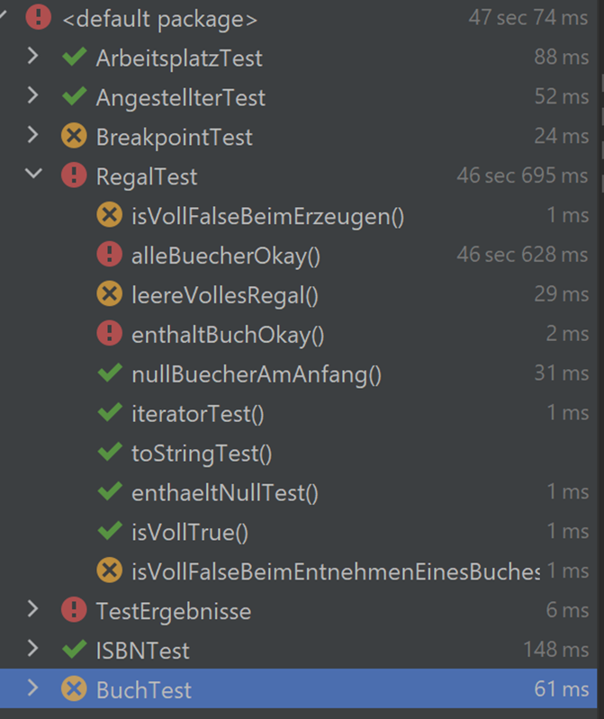

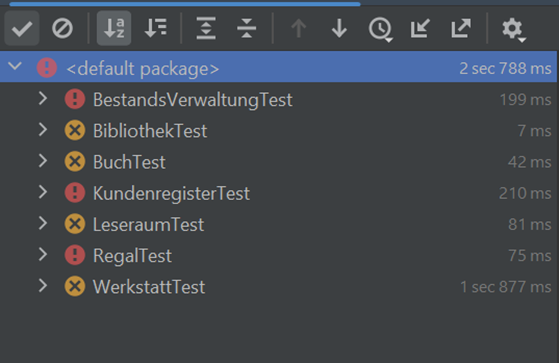

Zu sehen sind zwei verschiedene Ansichten der Test-Übersicht.
Die linke Seite zeigt die Übersicht aller Tests, die im Projekt vorhanden sind.
Die rechte Seite zeigt die Übersicht der Tests, die fehlschlugen bzw. abgebrochen wurden.
Jede Test-Klasse separat aufgelistet und in ihren Packages eingeordnet (In diesem Beispiel gibt es nur das default/root-Package).\
Nun sollte eine Test-Klasse ausgewählt werden, die abgebrochene Tests enthält (siehe Hinweis).
Der Grund dafür ist, dass diese Test ungewollt beendet wurden.
Dies sollte nicht passieren und zeigt, dass es schwerer Fehler gibt, die behoben werden müssen.
Zum Vergleich, fehlgeschlagene Tests sind Tests, die zwar durchlaufen, aber nicht das erwartete Ergebnis liefern.
Das bedeutet wir können relativ schnell den Fehler finden, weil die Tests einen kleinen Bereich des Codes testen und durch ihren Aufbau bereits hinweisen, wo der Fehler höchstwahrscheinlich ist.

> Hinweis!\
> Hier wird eine Annahme getroffen, dass die Tests korrekt implementiert und gut sind.
> Auch gehen wir davon aus, dass es gute und sinnvolle Tests sind, die auch wirklich Fehlerwirkungen testen.
> In der Realität ist das nicht immer so.
> Auch Tests können Fehler enthalten und damit falsche Ergebnisse liefern.
> Ein einzelner Testfall kann auch viel zu groß gefasst sein und damit nicht wirklich einen Fehler finden bzw. einschänken, weil der Bereich zu groß ist.
> Deshalb ist es auch eine wichtige Fähigkeit, gute Tests schreiben zu können.
> Es kann auch argumentieren, dass es sinnvoll ist, die fehlgeschlagenen Tests zuerst zu beheben, weil diese eben den Bereich eingrenzen und schnell gefunden werden können.
> Für dieses Projekt ist es aber sinnvoll, die abgebrochenen Tests als Beispiel zu nehmen, weil damit der Debugger und die Möglichkeiten des Debuggens intensiver genutzt werden können und das Verständnis besser vermittelt.

Sehen wir uns also die abgebrochenen Tests für die Klasse `KundenRegisterTest` an.

##### Informationen aus den Tests holen

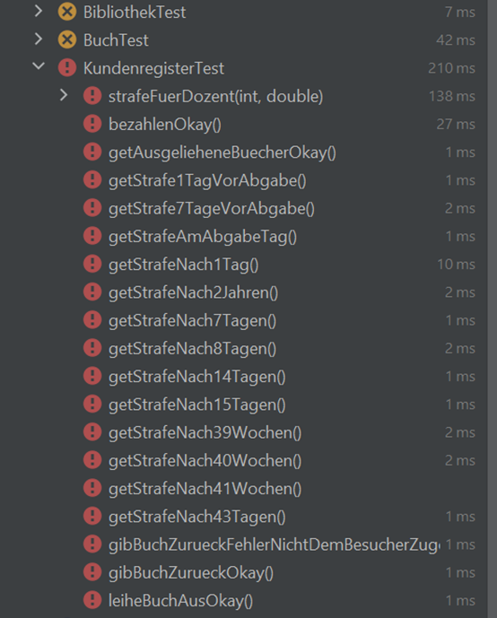

Überraschenderweise sind alle Tests abgebrochen.
Es ist also ein schwerwiegender Fehler im Code, der dazu führt, dass jeder Test dieser Test-Klasse abgebrochen wird.
Nun sollten die Informationen, die im Test-Fenster angezeigt werden, genauer betrachtet werden.
Sieht man sich einen der Tests an, so wird der Stack Trace angezeigt.

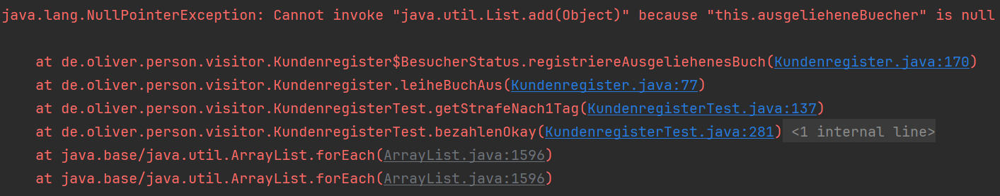

Zu sehen ist der Stack Trace des Tests `bezahlenOkay()`.
Der Stack Trace sagt, dass die Exception `NullPointerException` geworfen wurde.
Zudem wird der Grund der Exception angezeigt:
`Cannot invoke "java.util.List.add(Object)" because "this.ausgelieheneBuecher" is null`.
Sehr schön.
Daurch ist ziemlich klar worauf nun geachtet werden muss.
Es muss also geschaut werden, wann `ausgelieheneBuecher` null wird.\

#### Vorbereiten für das Debuggen

Wir wissen, dass wir während des Tests `bezahlenOkay()` eine `NullPointerException` erhalten und diese von
`ausgelieheneBuecher` kommt.
In dem Testfall haben wir die Methode `bezahlen()` untersucht.
Dementsprechend wird sie auch in der Test-Methode aufgerufen.
Also setzen wir einfach einen Breakpoint in der Zeile der Test-Methode, in der `bezahlen()` aufgerufen wird.

> Man könnte auch einen Breakpoint am Anfang der Methode
`bezahlen()` setzen. Jedoch wird in diesem Beispiel der Breakpoint in der Test-Methode gesetzt, um zu zeigen, dass auch Tests debuggt werden können und man schon da Informationen erhalten kann.

Wenn der Breakpoint gesetzt ist, wird die Test-Methode im Debug-Modus gestartet.
Der Debugger sollte an der Stelle des Breakpoints anhalten und die IDE sollte in den Debug-Modus wechseln und entsprechende Fenster anzeigen bzw. Objekte hervorheben.

#### Debuggen des Tests

Leider ist es in diesem Beispiel nicht der Fall, dass das Programm an der Stelle des Breakpoints anhält.
Der Test wird schon vorher abgebrochen.
Das bedeutet, dass der Fehler nicht in der Methode `bezahlen()` ist, sondern woanders.
Hier hilft der Stack Trace oder sogar die IDE weiter.
Wenn man den Stack Trace genauer betrachtet, dann steht da, dass die Zeile, in der der Test abbricht, weiter oben ist (Im Beispiel in Zeile 281).
Die bezahlen-Methode wird aber erst in Zeile 283 aufgerufen.
Je nach IDE kann das sogar direkt angeklickt werden und die IDE springt zu der Zeile bzw. markiert sogar direkt die Stelle im Test.

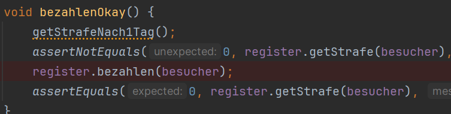

In der Abbildung ist das zu sehen, dass die IDE IntelliJ IDEA die Zeile 281 markiert hat (gelb unterstrichen).
Also setzen wir den Breakpoint in der Zeile 281 und starten den Test erneut im Debug-Modus.
Dieses Mal hält der Debugger an der Stelle an und die IDE wechselt in den Debug-Modus.
Im Variablen-Fenster sind nun alle Variablen und Objekte sichtbar, die in der Test-Methode existieren.
Leider lässt sich hier nicht viel erkennen.
Das Objekt ausgelieheneBuecher ist nicht zu lesen.
Okay aber im Stack Trace stehen ja auch noch zwei Zeilen darüber.
Also müssen wir noch in zwei weitere Methoden "hineinspringen" um zur
NullPointerException zu gelangen.
Also führen wir einen Step-Into-Befehl aus.
Und wir landen am Anfang der Methode `getStrafeNach1Tag`.
Hier sagte uns der Stack Trace, dass wir bis Zeile 137 gehen müssen.
Wir sind aber in der Zeile 135.
Also müssen wir noch zwei Zeilen weiter gehen.
Dafür klicken wir einfach auf den Step-Over-Button, bis wir in der Zeile 137 sind.
Während wir das machen, können wir im Variablen-Fenster je nach Konfiguration sehen, was sich ändert.\
Nun befinden wir uns an der Stelle wo der Abbruch passiert in der Methode.
Also gehen wir hier erneut mit einem Step-Into-Befehl in die Methode `leiheBuchAus()`.
In dieser Methode gibt es nur eine Zeile im Rumpf.

```jshelllanguage
public boolean leiheBuchAus(Buch buch, Besucher besucher) {
	return alleBesucher.get(besucher.getID()).registriereAusgeliehenesBuch(buch);
}
```

Was nun?
Wo gehe ich jetzt hin?
Der Stack Trace gibt auch hier wieder Hilfe.
Er schreibt dass in der Methode `registriereAusgeliehenesBuch()` der Fehler aufgetreten ist.
Also gehen wir wieder mit einem Step-Into-Befehl in die Methode `registriereAusgeliehenesBuch()`.

> Achtung!\
> Diese Methode ist nicht die "erste" Anweisung die Ausgeführt wird in der Zeile.
> Es ist die getId()-Methode. Die IDE (IntelliJ) gibt uns aber die Möglichkeit, in die Methode zu springen, die wir wollen. Sie markiert die Methoden farblich und durch Anklicken der gewünschten Methode springen wir an die richtige Stelle.
> Die Methode getId() wird dennoch ausgeführt.

> Man hätte auch direkt an die Stelle gekonnt, wenn der Breakpoint einfach an diese Stelle gesetzt worden wäre.

Nun sind wir an der Stelle, an der der Fehler aufgetreten ist.
Ein Blick ins Variablen-Fenster zeigt, dass `ausgelieheneBuecher` tatsächlich null ist.
Aber moment mal.
Wir kommen direkt in die Methode und das Objekt ist bereits null.
Das lässt den Schluss zu, dass das Objekt `ausgelieheneBuecher` nicht initialisiert wurde.
Es kann eigentlich nur zwei Stellen geben, wo Attribute initialisiert werden.

1. Bei der Deklaration des Attributs
2. Im Konstruktor der Klasse

Wenn beide das nicht machen, dann ist das Attribut durch den default-Wert in Java null.
Also wie sehen diese beiden Stellen aus.

```java
private static final class BesucherStatus {
	private       List<Buch>  ausgelieheneBuecher;
	private       Double      strafe = 0.0;
	private final BesucherTyp besucherTyp;

	private BesucherStatus(Besucher besucher) {
		besucherTyp =
				switch (besucher) {
					case Dozent d -> BesucherTyp.Dozent;
					case Studierender ignored -> BesucherTyp.Studierender;
					default -> BesucherTyp.Normal;
				};
	}
	// ...
}
```

Überraschenderweise wird `ausgelieheneBuecher` weder an der einen noch an der anderen Stelle initialisiert.
Also haben wir den Fehler gefunden.
Nun ist es ein leichtes den Fehler zu beheben.
Einfach ein `new ArrayList<>()` dem Attribut an einer der beiden Stellen zuweisen und schon ist das Problem behoben.\

#### Kontrollieren der Korrektur

Wir haben jetzt den Fehler gefunden und behoben.
Aber war es denn auch der richtige Fehler?
Die Antwort kann uns nur ein erneutes Ausführen der Tests geben.
Also führen wir die Tests erneut aus.

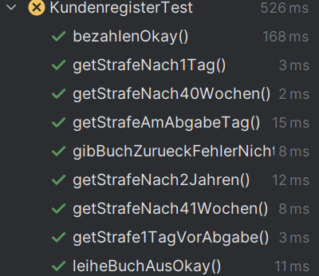

Überraschung.
Plötzlich sind fast alle Tests erfolgreich.
Das bedeutet, diese eine kleine Stelle hat so viele Fehler abbrechen lassen.
Das zeigt ein Mal mehr, wie wichtig es ist, Tests zu schreiben und das viele Tests auch eine Sicherheit geben, dass eine Änderung auch einen Effekt hat der bemerkt wird.
Es zeigt auch, dass es kritische Stellen gibt, die unbedingt getestet werden müssen.
Hätten wir z.B. einen Testfall, der nach der Erstellung des Objektes direkt geprüft hätte, ob
`ausgelieheneBuecher` null ist, dann wäre der Fehler sofort aufgefallen und könnte direkt behoben werden.

> Auch hier noch mal der Hinweis, dass es keine Regel gibt, welcher Test zuerst behoben werden soll.
> Es gibt Situationen, in denen abgebrochene Test höchste Priorität haben, weil sie auf schwerwiegende Fehler hinweisen.
> Genauso gibt es aber auch Situationen, in denen fehlgeschlagene Tests wichtiger sind, weil sie bereits auf die Stellen hinweisen und schneller beseitigt werden können.

Nun wiederholt sich der Prozess.
Es wird der nächste Test ausgewählt, der abgebrochen ist.
Es werden wieder die Informationen aus dem Test-Fenster geholt.
Es wird wieder ein Breakpoint gesetzt und der Test im Debug-Modus gestartet.
So wird der Prozess immer wiederholt, bis alle Tests erfolgreich sind.
Erst dann sollte neue Funktionalität implementiert werden.

<hr>

## Bibliothek

Dies ist das große Beispiel, in dem die neuen Kenntnisse angewendet und gefestigt werden sollen.
Hier darf experimentiert und kaputt gemacht werden.

### Situation

Die HelloLibrary wurde inzwischen um eine Mitarbeiterverwaltung und ein Kundenregister erweitert.
Die Bibliothek ist inzwischen ziemlich groß geworden und wird deshalb von Personal verwaltet und hat weitere Räume
bekommen.
Nun soll es auch möglich sein, dass Kunden Bücher ausleihen können und auch zurückgeben können.
Bücher werden dabei in Regale gestellt.
Werden Bücher ausgeliehen, so werden sie aus dem entsprechenden Regal genommen.
Bei der Nutzung der Bücher kann es passieren, dass sie beschädigt werden.

Zwei SHKs haben diese Anwendung gebaut.
Der eine hat die Tests, der andere den Quellcode geschrieben.
Leider sind im Quellcode Fehler.
Dies wurde durch die Tests herausgefunden.
Die SHKs sind nicht mehr angestellt und die Fehler müssen schnell behoben werden.
Die Tests sind **korrekt** implementiert und benötigen **keine Korrektur**.

### Aufgabe

Finden Sie die Fehler in der Implementierung.
Dabei sollen die Tests als Hilfestellung dienen.
Die `HelloLibrary`-Methoden können als korrekt angesehen werden.
Es gibt zwei Phasen dieser Aufgabe.
Die Erste ist es die Bugs anhand der Tests zu finden.
In der zweiten Phase sollen dann durch die falschen Konsolen-Outputs die Fehler gefunden werden.
Tests, die bereits zu Anfang erfolgreich sind, sollen als Hilfe dienen, wo der Fehler **nicht** ist.  
Da nicht alle Klassen getestet sind muss hier durch cleveres Debuggen der Fehler gefunden werden.\
Die folgenden Abschnitte geben weitere Informationen zur Implementierung.

#### Die Bibliothek

Die Verwaltung der Bibliothek besteht aus einer Bestandsverwaltung, Mitarbeiterverwaltung und dem Kundenregister.
Die Bibliothek besitzt jetzt Leseräume, sowie eine Werkstatt.
An Terminals (BesucherComputer, AngestelltenComputer) können Dienste der Bibliothek genutzt werden.

#### Verschmutzbare Objekte

Jeder Arbeitsplatz, Leseraum, jedes Regal und alle Bücher werden über die Zeit verschmutzt.
Diese müssen dann von einer Reinigungskraft gesäubert werden.

#### Personal

Es gibt drei Arten von Mitarbeitern.

- *Bibliothekare* arbeiten an Tresen, und vergeben die Leseräume der Bibliothek und
  können am Terminal nach Büchern suchen. Sie können auch neue Besucher in der Bibliothek anlegen (Kundenregister).
- *Reinigungskräfte* säubern alle Arbeitsplätze. Regale und die darin enthaltenen Bücher werden ebenfalls von den
  Reinigungskräften gesäubert.
- In der Werkstatt wird ein beschädigtes Buch von einem *Restaurator* wieder in stand gesetzt und dann zurück in ein
  Regal gestellt.

#### Besucher

Zurzeit kennt die Bibliothek zwei Arten von Besuchern.
**Studierende** und **Dozenten**.
Beide haben die gleichen Möglichkeiten.
Das sind:

* Buch ausleihen
* Nach Buch suchen (verschiedene Kriterien)
* Buch zurückgeben
* Leseraum reservieren
* Leseraum verlassen
* Strafen zahlen

Zusätzlich können Dozenten ihre Bücher länger ausleihen und zahlen keine
Strafgebühren.

#### Ausleihe

Bücher können höchstens 28 Tage ausgeliehen werden.
Danach fallen Mahngebühren an.
Die Kosten der Rückgabe berechnen sich wie folgt.

1. Für die Tage 1-7 wird jeden Tag 1 € berechnet.
2. Ab dem 8. Tag wird jede angefangene Woche 5 € verlangt.
3. Ab 43 Tagen wird 2 € pro angefangener Woche verlangt.
4. Die Strafe darf nie mehr als 100 € betragen
5. Dozenten können das Buch so lange sie wollen ausleihen. Sie zahlen keine Gebühren.

Bei der Rückgabe wird überprüft, ob ein Buch beschädigt ist und ob es rechtzeitig zurückgegeben wurde.
Ist die Beschädigung über 80 %, so wird es zur Restauration in die Werkstatt geschickt.
Das Buch ist bis zur fertigen Reparatur bzw. bis es wieder in einem Regal ist nicht ausleihbar.

#### Bücher

Ein Buch ist ein Medium, das von einem Author verfasst wurde.
Es enthält Text und einen Titel.
Ist ein Buch mehrmals in der Bibliothek, werden die Instanzen durch einen Code (Zufallszahl) unterschieden.

##### ISBN

Die ISBN ist eine eindeutige ID des Buches.
Es sind 13 Zahlen, die Region, Verlag, Titel und eine Prüfziffer repräsentieren.

##### Beschädigung

Jedes Buch kann beschädigt werden.
Wenn es eine bestimmte Beschädigung überschreitet, gilt es als kaputt.
Ist dies der Fall, muss es repariert werden.
In dieser Aufgabe ist es möglich Bücher über 100 % zu beschädigen.
Das ist jedoch kein Fehler und vereinfacht lediglich das Programm.

##### Ausleihbar

Ein Buch ist ausleihbar.
Dies ist dann einem Besucher zugeordnet.
Ein Buch kann nicht mehreren Personen ausgeliehen werden.

#### Bestand

Im Bestand sind *alle* Bücher der Bibliothek hinterlegt.
Jedes Buch wird in ein Regal eingeordnet.
Jedes Regal hat eine feste Anzahl an Büchern, die es aufnehmen kann.
Diese Bücher werden in Regalbrettern aufbewahrt.
Jedes Regalbrett eines Regals hat die gleiche Anzahl an Büchern, die es aufnehmen kann.

Der Bestand kann nach folgenden Kriterien durchsucht werden,

1. nach Author
2. nach ISBN
3. nach Titel
4. Nach Treffer

**Hinweis:** "Nach Treffer" kann selbst implementiert werden.

#### Leseräume

Ein Leseraum ist für eine feste Anzahl an Personen ausgelegt. Diese kann je nach Raum variieren.
Eine Reservierung für einen Raum kann bei einem Bibliothekar am Computer vorgenommen werden.
Je nach Nutzung wird der Leseraum verschmutzt.

#### Angestelltenverwaltung

Die Angestelltenverwaltung kann Angestellte einstellen und wieder entlassen.
Es ist möglich, Angestellte zu suchen und zu filtern.

<hr>

## Literatur und Quellen

Für die vorgestellten Konzepte und Methoden gibt es viele verschiedene Quellen.
Deshalb sei hier eine Auflistung von Quellen, die für dieses Projekt genutzt wurden.
Zudem wird auch weitere Literatur genannt, die genutzt werden kann, um die Konzepte zu vertiefen.

### Debugging

- Debugger für Java [Java Debugger](https://docs.oracle.com/en/java/javase/21/docs/specs/man/jdb.html)
- Funktion des Java Debuggers [JPDA](https://docs.oracle.com/en/java/javase/21/docs/specs/jpda/architecture.html)

### Tests

- JUnit 5 [JUnit5](https://junit.org/junit5/docs/current/user-guide/)
- Mockito [Mockito](https://site.mockito.org)
- International Software Testing Qualifications Board [ISTQB](https://www.istqb.org/)
- German Testing Board [GTB](https://www.gtb.de/)
- Lehrplan des ISTQB [ISTQB Lehrplan](https://istqb.org/?sdm_process_download=1&download_id=3345)
- Lehrpläne des GTB [GTB Lehrplan](https://www.gtb.de/der-certified-tester/lehrplaene/)

### IDEs

- [IntelliJ IDEA](https://www.jetbrains.com/de-de/idea/)
- [Visual Studio Code](https://code.visualstudio.com/)
- [NetBeans](https://netbeans.apache.org/)
- [Eclipse](https://www.eclipse.org/)

